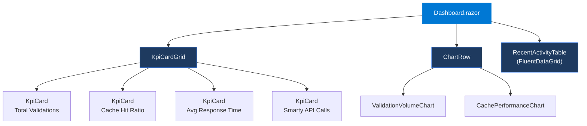
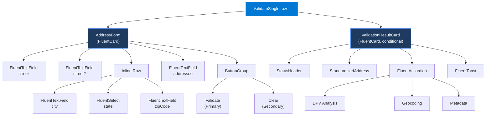
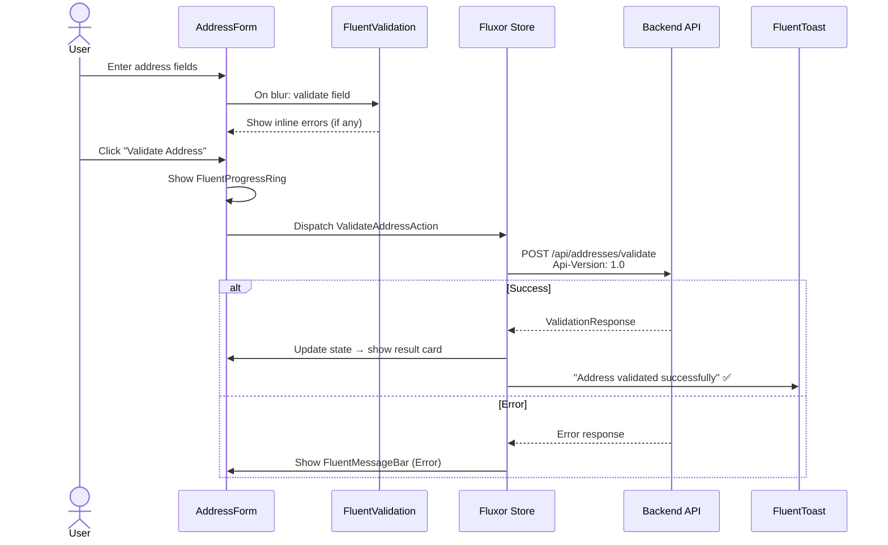
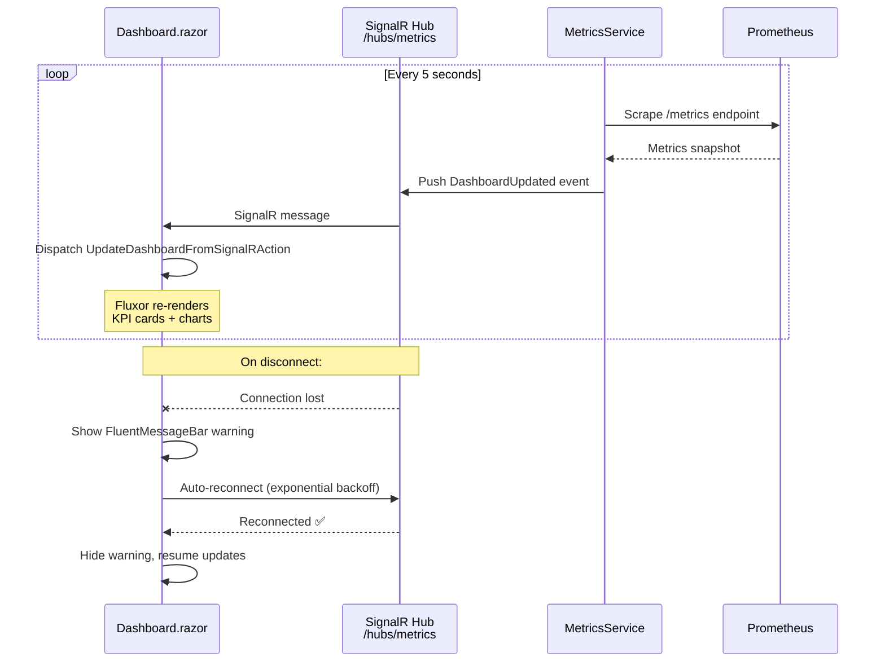
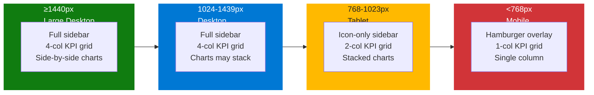

# Address Validation Proxy Service

Frontend Design Specification
Blazor Interactive Server + Microsoft Fluent UI Blazor

 Version 1.0  |  May 6, 2026  |  Alex Khorozov  |  Draft  |  Internal

## Document Control

| Field | Value |
| --- | --- |
| Document Title | Address Validation Proxy Service — Frontend Design Specification |
| Version | 1.0 |
| Date | May 6, 2026 |
| Author | Alex Khorozov |
| Status | Draft |
| Classification | Internal |
| Related Documents | SRS v2.1, Project Kick-off Presentation |

### Revision History

| Version | Date | Author | Description |
| --- | --- | --- | --- |
| 1.0 | May 6, 2026 | Alex Khorozov | Initial draft — full frontend design specification |

---

## Table of Contents

1. Introduction

1.1 Purpose

1.2 Scope

1.3 Technology Stack

1.4 Target Users

2. Design System — Fluent UI Tokens

2.1 Color Palette

2.2 Typography

2.3 Spacing & Layout Grid

2.4 Elevation & Shadows

2.5 Border Radius

2.6 Animation & Motion

3. Application Shell & Layout

3.1 Overall Layout Structure

3.2 Header Component (Header.razor)

3.3 Sidebar Navigation (NavMenu.razor)

3.4 Breadcrumb Navigation

4. Page Designs

4.1 Dashboard Page (/)

4.2 Validate Address Page (/validate)

4.3 Batch Validation Page (/batch)

4.4 Cache Management Page (/cache)

4.5 Audit Log Page (/audit)

4.6 Health & Metrics Page (/health)

4.7 Settings Page (/settings)

5. Component Library Mapping

5.1 Fluent UI Blazor Component Reference

6. State Management (Fluxor)

6.1 Architecture

6.2 State Stores

6.3 Key Actions

6.4 Effects (Async Side Effects)

7. API Client Service

7.1 IAddressValidationApiClient Interface

7.2 HTTP Configuration

8. Real-Time Updates (SignalR)

8.1 SignalR Hub

8.2 Dashboard Auto-Refresh

9. Responsive Design

9.1 Breakpoints

9.2 Responsive Behaviors

10. Accessibility (WCAG 2.1 AA)

10.1 Compliance Targets

10.2 Requirements

10.3 Testing

11. Error Handling & Empty States

11.1 Error States

11.2 Empty States

11.3 Loading States

12. Testing Strategy

12.1 Unit Tests

12.2 Integration Tests

12.3 Accessibility Tests

12.4 Visual Regression

13. Deployment & Configuration

13.1 Aspire Integration

13.2 Azure Container Apps Deployment

13.3 Environment Variables

---

# 1. Introduction

## 1.1 Purpose

This document defines the visual design, component architecture, interaction patterns, and user experience guidelines for the Address Validation Proxy frontend application. It serves as the definitive reference for implementing the Blazor Interactive Server + Fluent UI Blazor frontend, providing all stakeholders — frontend developers, UX designers, product managers, and QA engineers — with a single source of truth for UI construction.

This specification is a companion to the Software Requirements Specification (SRS v2.1) and should be read alongside it for full technical context. Where the SRS defines backend behavior and API contracts, this document governs how those contracts are consumed and presented to the end user.

## 1.2 Scope

This document covers all seven application pages that compose the Address Validation Proxy frontend:

1. **Dashboard** — Real-time operational overview
2. **Validate Address** — Single address validation form
3. **Batch Validation** — CSV file upload and multi-address validation
4. **Cache Management** — Two-tier cache monitoring and administration
5. **Audit Log** — Event sourcing audit trail browser
6. **Health & Metrics** — System health and performance monitoring
7. **Settings** — System configuration viewer

The specification encompasses design tokens, component-to-library mapping, responsive behavior across breakpoints, accessibility standards (WCAG 2.1 AA), state management architecture (Fluxor), real-time update patterns (SignalR), and deployment configuration.

## 1.3 Technology Stack

| Technology | Purpose |
| --- | --- |
| Blazor Interactive Server (.NET 10) | Frontend framework — server-side rendering with SignalR interactivity |
| Microsoft.FluentUI.AspNetCore.Components v4.x | Component library — Fluent Design System for Blazor |
| SignalR | Real-time bidirectional communication for live metrics |
| Fluxor | State management — Redux pattern for predictable state updates |
| .NET Aspire | Orchestration — service discovery, configuration, and local development alongside the API backend |
| Polly | Resilience — retry and timeout policies on HTTP calls to backend API |

## 1.4 Target Users

| User Role | Primary Tasks | Key Pages |
| --- | --- | --- |
| **Operations Team** | Monitor system health, review validation metrics, manage cache | Dashboard, Health & Metrics, Cache Management |
| **Support Staff** | Look up validation results, review audit logs, troubleshoot issues | Validate Address, Audit Log, Batch Validation |
| **Administrators** | Manage settings, API keys, review system configuration | Settings, Health & Metrics, Cache Management |

Note — Concurrency Estimate

Estimated concurrent users: fewer than 50. This is an internal operations dashboard, not a public-facing application. UI performance budgets are calibrated accordingly.

---

# 2. Design System — Fluent UI Tokens

All visual properties in this application derive from the Microsoft Fluent Design System token set. The following tables define the canonical token values used throughout the frontend. These tokens map directly to the Fluent UI Blazor component library's built-in design token infrastructure.

## 2.1 Color Palette

### Brand Colors

| Token Name | Hex Value | Usage |
| --- | --- | --- |
| Brand Primary |  #0078D4 | Primary actions, active nav indicator, links, focus rings |
| Brand Primary Hover |  #106EBE | Button hover states |
| Brand Primary Pressed |  #005A9E | Button pressed/active states |

### Neutral Colors

| Token Name | Hex Value | Usage |
| --- | --- | --- |
| Neutral Background 1 |  #FFFFFF | Card surfaces, dialogs, main content area |
| Neutral Background 2 |  #FAFAFA | Page background |
| Neutral Background 3 |  #F5F5F5 | Sidebar, secondary surfaces, hover rows |
| Neutral Foreground 1 |  #242424 | Primary text, headings |
| Neutral Foreground 2 |  #616161 | Secondary text, labels, subtitles |
| Neutral Foreground 3 |  #9E9E9E | Placeholder text, disabled elements |
| Neutral Stroke 1 |  #E0E0E0 | Borders, dividers, card outlines |
| Neutral Stroke 2 |  #C4C4C4 | Input borders, drag zone borders |

### Status Colors

| Token Name | Hex Value | Usage |
| --- | --- | --- |
| Status Success |  #107C10 | Valid address status, healthy indicators, positive trends |
| Status Warning |  #FFB900 | Partial match, degraded status, circuit half-open |
| Status Error |  #D13438 | Invalid address, errors, unhealthy dependencies |
| Status Info |  #0078D4 | Informational badges, tips, neutral status indicators |

## 2.2 Typography

| Element | Font | Weight | Size | Line Height |
| --- | --- | --- | --- | --- |
| Display / Page Title | Segoe UI | 600 (Semibold) | 28px | 36px |
| Section Heading (H2) | Segoe UI | 600 (Semibold) | 20px | 28px |
| Subsection (H3) | Segoe UI | 600 (Semibold) | 16px | 24px |
| Body Text | Segoe UI | 400 (Regular) | 14px | 20px |
| Body Small | Segoe UI | 400 (Regular) | 12px | 16px |
| Caption | Segoe UI | 400 (Regular) | 10px | 14px |
| Monospace (code/IDs) | Cascadia Code | 400 (Regular) | 13px | 18px |
| KPI Large Number | Segoe UI | 700 (Bold) | 32px | 40px |
| Badge Text | Segoe UI | 600 (Semibold) | 11px | 14px |

Typography Note

Segoe UI is the native Fluent Design System typeface and is pre-installed on all Windows systems. For non-Windows browsers, the Fluent UI Blazor library includes a webfont fallback. Cascadia Code is used exclusively for monospaced content such as request IDs, JSON payloads, and code blocks.

## 2.3 Spacing & Layout Grid

| Token | Value | Usage |
| --- | --- | --- |
| spacing-xxs | 2px | Inline icon gaps, tight micro-spacing |
| spacing-xs | 4px | Badge padding, tight element spacing |
| spacing-s | 8px | Card internal padding edges, small gaps |
| spacing-m | 12px | Form field gaps, list item spacing |
| spacing-l | 16px | Card padding, section gaps |
| spacing-xl | 24px | Page section margins, major separations |
| spacing-xxl | 32px | Page top/bottom padding, layout margins |

### Layout Dimensions

| Element | Value | Notes |
| --- | --- | --- |
| Grid Columns | 12 | Responsive grid system used for page layouts |
| Sidebar Width (Expanded) | 256px | Full navigation with labels |
| Sidebar Width (Collapsed) | 48px | Icon-only navigation |
| Header Height | 48px | Fixed top header bar |
| Content Max-Width | 1440px | Maximum content area width; centered beyond this |

## 2.4 Elevation & Shadows

| Level | Shadow Definition | Usage |
| --- | --- | --- |
| Level 0 | none | Flat elements, inline content, text |
| Level 1 | 0 2px 4px rgba(0,0,0,0.08) | Cards at rest, static containers |
| Level 2 | 0 4px 8px rgba(0,0,0,0.12) | Cards on hover, dropdown menus |
| Level 3 | 0 8px 16px rgba(0,0,0,0.14) | Dialogs, modals, confirmation popups |
| Level 4 | 0 16px 32px rgba(0,0,0,0.18) | Flyouts, tooltips, overlaying panels |

## 2.5 Border Radius

| Element | Radius | Notes |
| --- | --- | --- |
| Buttons, Inputs | 4px | Subtle rounding for interactive elements |
| Cards | 8px | Container-level rounding |
| Badges | 12px (pill) | Fully rounded pill shape for status indicators |
| Avatars | 50% (circle) | Circular user personas |
| Dialogs | 8px | Consistent with card rounding |

## 2.6 Animation & Motion

| Transition | Duration | Easing | Usage |
| --- | --- | --- | --- |
| Button hover | 100ms | ease-out | Background color change on hover |
| Card elevation | 200ms | ease-in-out | Shadow lift on hover |
| Page transition | 250ms | ease-in-out | Fade between page navigations |
| Sidebar collapse | 200ms | ease-in-out | Width transition on collapse/expand |
| Toast enter | 300ms | cubic-bezier(0.33,1,0.68,1) | Slide in from top-right corner |
| Toast exit | 200ms | ease-in | Fade out and collapse |
| Progress ring | 1500ms | linear | Continuous rotation for loading |

Reduced Motion

All animations must respect the **prefers-reduced-motion** media query. When the user has indicated a preference for reduced motion in their operating system settings, all transitions should be disabled or reduced to instantaneous state changes.

---

# 3. Application Shell & Layout

## 3.1 Overall Layout Structure

The application shell uses the **FluentMainLayout** component from the Fluent UI Blazor library, providing a fixed header, collapsible sidebar, and scrollable main content area. The following diagram illustrates the spatial arrangement:

```mermaid
block-beta
    columns 5

    block:header:5
        hamburger["☰"] menu_logo["🔷 Address Validation Proxy"] space:1 bell["🔔 3"] avatar["AK ▾"]
    end

    block:sidebar:1
        nav_dash["📊 Dashboard"]
        nav_valid["✉️ Validate Address"]
        nav_batch["📋 Batch Validation"]
        nav_cache["🗄️ Cache Management"]
        nav_audit["📜 Audit Log"]
        nav_health["💚 Health & Metrics"]
        nav_settings["⚙️ Settings"]
    end

    block:main:4
        breadcrumb["Home > Current Page"]
        title["Page Title (28px Semibold)"]
        block:cards:4
            card1["Card 1"] card2["Card 2"] card3["Card 3"] card4["Card 4"]
        end
        content["Main Content Area (scrollable, max-width: 1440px)"]
    end

    style header fill:#FFFFFF,stroke:#E0E0E0,color:#242424
    style sidebar fill:#F5F5F5,stroke:#E0E0E0,color:#242424
    style main fill:#FAFAFA,stroke:#E0E0E0,color:#242424
```

## 3.2 Header Component (Header.razor)

| Property | Specification |
| --- | --- |
| Position | Fixed top, z-index: 1000 |
| Height | 48px |
| Background | #FFFFFF |
| Border | border-bottom: 1px solid #E0E0E0 |
| Left Content | Hamburger menu toggle (FluentIcon: Navigation24Regular), Application logo (16px), Application title "Address Validation Proxy" (Segoe UI, 16px, Semibold, #242424) |
| Right Content | Notification bell (FluentIcon: Alert24Regular) with FluentBadge count overlay (red circle), User persona (FluentPersona: initials "AK", size 32px, Name="Alex Khorozov") |
| Responsive | On screens below 768px, application title truncates with ellipsis; persona shows initials only |

## 3.3 Sidebar Navigation (NavMenu.razor)

The sidebar uses the **FluentNavMenu** component with **FluentNavLink** items for each page. Navigation state is driven by the Blazor router.

### Navigation Items

| # | Label | Icon (Fluent Icons) | Route |
| --- | --- | --- | --- |
| 1 | Dashboard | DataBarVertical24Regular | / |
| 2 | Validate Address | Mail24Regular | /validate |
| 3 | Batch Validation | DocumentBulletList24Regular | /batch |
| 4 | Cache Management | Database24Regular | /cache |
| 5 | Audit Log | DocumentText24Regular | /audit |
| 6 | Health & Metrics | HeartPulse24Regular | /health |
| 7 | Settings | Settings24Regular | /settings |

### Navigation States

| State | Visual Treatment |
| --- | --- |
| Default | Icon #616161, Label #242424, background transparent |
| Hover | Background #F0F0F0 |
| Active (current page) | Left border 3px solid #0078D4, background #E8F0FE, icon and text color #0078D4 |
| Collapsed (below 1024px) | Sidebar narrows to 48px; labels hidden; icons only with FluentTooltip on hover |

## 3.4 Breadcrumb Navigation

| Property | Specification |
| --- | --- |
| Component | FluentBreadcrumb + FluentBreadcrumbItem |
| Position | Below header, above page title, within main content area |
| Structure | Always: Home > [Current Page Name] |
| Behavior | "Home" is always clickable and links to the Dashboard (/). Current page item is non-clickable and displayed in #616161. |
| Typography | Body Small (12px, Regular) |

---

# 4. Page Designs

## 4.1 Dashboard Page (/)

**Purpose:** Real-time operational overview of the address validation system. This is the default landing page and the most-viewed screen in the application.

### Layout Grid

| Row | Content | Grid Columns |
| --- | --- | --- |
| Row 1 | KPI card grid — 4 stat cards | 4 x 3-col (large), 2 x 6-col (medium), 1 x 12-col (small) |
| Row 2 | Chart area — 2 charts side by side | 2 x 6-col (large/medium), 1 x 12-col (small) |
| Row 3 | Recent activity table — full width | 1 x 12-col |

### KPI Cards

Each card is a **FluentCard** at Elevation Level 1, containing a large metric number, a descriptive label, and a trend indicator.

| Card | Value (KPI Large Number) | Label (Body Text) | Trend / Indicator |
| --- | --- | --- | --- |
| Total Validations Today | 12,847 | Total Validations Today | FluentBadge: "+8.3% ↑" (#107C10 green background) |
| Cache Hit Ratio | 78.4% | Cache Hit Ratio | FluentProgressRing (circular, 78.4% filled, #0078D4) |
| Avg Response Time | 45ms | Avg Response Time | FluentBadge: "● Healthy" (#107C10, with green dot) |
| Smarty API Calls | 2,771 | Smarty API Calls | FluentBadge: "-12% ↓" (#107C10 green, savings positive) |

### Charts

| Chart | Specification |
| --- | --- |
| Validation Volume (24h) | **Left panel.** Vertical bar chart with 24 bars (one per hour). Bar fill: #0078D4. X-axis: hours (00–23). Y-axis: request count. Implemented via a Blazor-compatible charting library or CSS-based HTML bars. Shows current-day volume trends. |
| Cache Performance | **Right panel.** Donut/ring chart with three segments: Redis Hits 45% (#0078D4), CosmosDB Hits 33.4% (#107C10), Smarty Calls 21.6% (#9E9E9E). Legend displayed below the chart with color key and percentage labels. |

### Recent Activity Table

A **FluentDataGrid** displaying the five most recent address validation events. Auto-refreshes every 5 seconds via SignalR push.

| Column | Type | Width | Details |
| --- | --- | --- | --- |
| Timestamp | DateTime | 160px | Format: "May 6, 2026 07:42:15 AM" — Body Small font |
| Input Address | String | auto | Truncate with ellipsis at 40 characters; FluentTooltip shows full address |
| Status | FluentBadge | 100px | Valid (#107C10), Invalid (#D13438), Partial (#FFB900) |
| Cache Level | FluentBadge | 80px | L1 (#0078D4 blue), L2 (#00B7C3 teal), Miss (#9E9E9E gray) |
| Response Time | String | 100px | Format: "23ms" — monospace font (Cascadia Code) |

### Component Tree

---

## 4.2 Validate Address Page (/validate)

**Purpose:** Single US address validation against USPS standards via the Smarty API provider. This is the primary workflow page for support staff performing ad-hoc address lookups.

### Layout

Two-panel horizontal split: **60% left panel** (address form) and **40% right panel** (validation result). On screens below 1200px, panels stack vertically with the form above and the result below.

### Left Panel — Address Form (FluentCard)

| Field | Component | Properties |
| --- | --- | --- |
| Street Address | FluentTextField | Required=true, Placeholder="123 Main St", full width |
| Street Address 2 | FluentTextField | Required=false, Placeholder="Apt, Suite, Unit", full width |
| City | FluentTextField | Required=true, Width=50% (inline row) |
| State | FluentSelect<string> | Required=true, Width=25%, Items=US States (50 states + DC + territories), Placeholder="State" |
| ZIP Code | FluentTextField | Required=true, Width=25%, Pattern="^\d{5}(-\d{4})?$", Placeholder="00000" |
| Addressee | FluentTextField | Required=false, Placeholder="Recipient name (optional)" |

**API version badge:** A small FluentBadge displaying "v1.0" positioned in the card header to indicate the active API version.

**Action buttons:**

- **"Validate Address"** — FluentButton, Appearance.Primary. On click, shows inline FluentProgressRing while API call is in flight.
- **"Clear"** — FluentButton, Appearance.Secondary. Resets all form fields and clears the result panel.

**Validation behavior:** Real-time validation fires on input blur (Immediate=true). Invalid fields display a red (#D13438) error message below the field, and the field border changes to #D13438. Validation uses FluentValidationMessage linked via EditForm/EditContext.

### Right Panel — Validation Result (FluentCard)

This panel is hidden until a validation response is received. On success, it renders with the following structure:

#### Status Header

| Status | Icon | Text | Color |
| --- | --- | --- | --- |
| Valid | CheckmarkCircle24Filled | "VALID — DPV Confirmed" | #107C10 (green) |
| Partial Match | Warning24Filled | "PARTIAL MATCH" | #FFB900 (yellow) |
| Invalid | DismissCircle24Filled | "INVALID ADDRESS" | #D13438 (red) |

#### Accordion Sections (FluentAccordion, ExpandMode.Multi)

| Panel | Content |
| --- | --- |
| Standardized Address | USPS-formatted address in bold text. Example: "123 MAIN ST APT 4B / CHANTILLY VA 20151-1234" |
| DPV Analysis | Table with rows: dpvMatchCode, dpvFootnotes, dpvCmra (Y/N), dpvVacant (Y/N), active (Y/N) |
| Geocoding | Latitude, Longitude, Precision level (e.g., "Zip9") |
| Metadata | Provider ("Smarty"), Cache level (L1/L2/Miss), Response time ("23ms"), API version ("1.0") |

All accordion panels are expanded by default on first load.

### Component Tree

### Interaction Flow

1. User enters address fields.
2. On blur from each field, FluentValidation highlights errors inline (red border + error text).
3. User clicks "Validate Address."
4. FluentProgressRing appears inline on the button; button is disabled to prevent double-submit.
5. API call dispatches **ValidateAddressAction** → HTTP POST to `/api/addresses/validate` with `Api-Version: 1.0` header.
6. On success: result card appears in right panel; FluentToast notification confirms "Address validated successfully."
7. On error: FluentMessageBar (Error intent) appears above the form with error details and a retry suggestion.

---

## 4.3 Batch Validation Page (/batch)

**Purpose:** Validate up to 100 US addresses from a CSV file upload. This page follows a sequential vertical flow: upload → preview → results.

### Stage 1 — Upload Zone

| Property | Specification |
| --- | --- |
| Component | FluentInputFile |
| Border | 2px dashed #C4C4C4, border-radius: 8px |
| Height | 200px minimum |
| Center Content | Cloud upload icon (ArrowUpload24Regular, 48px), "Drag & drop CSV file here" (Body Text), "or click to browse" (link, #0078D4) |
| Accepted Formats | .csv only (Accept=".csv") |
| Info Bar | FluentMessageBar (Info): "CSV format: street, street2, city, state, zipCode — Maximum 100 addresses per batch" |

### Stage 2 — Preview Table

After file upload and parsing, a **FluentDataGrid** displays the parsed addresses for review before validation.

| Column | Details |
| --- | --- |
| # | Row number (1-based index) |
| Street | Parsed street address |
| City | Parsed city |
| State | Parsed state abbreviation |
| ZIP | Parsed ZIP code |
| Status | All show FluentBadge "Pending" (#9E9E9E gray) |

**Action buttons:** "Validate Batch" (Primary) | "Cancel" (Secondary) | "Remove File" (Subtle danger, red text)

### Stage 3 — Results Table

After validation completes, the DataGrid updates with results:

| Additional Column | Details |
| --- | --- |
| DPV Code | DPV match code (monospace font) |
| Cache Level | FluentBadge: L1 (blue), L2 (teal), Miss (gray) |
| Response Time | Milliseconds (monospace font) |

**Toolbar:** "Export to CSV" button (Secondary), filter dropdown (by status), record count display "8 of 8 processed."

**Summary bar** (below table, #F5F5F5 background): "Valid: 6 (75%) | Partial: 1 (12.5%) | Invalid: 1 (12.5%) | Avg Response: 28ms"

---

## 4.4 Cache Management Page (/cache)

**Purpose:** Monitor and manage the two-tier cache system (Redis L1 + CosmosDB L2). Used by operations teams to inspect cached entries, review cache performance, and perform administrative actions such as flushing the Redis cache.

### Stat Cards (Row 1)

| Card | Value | Detail / Badge |
| --- | --- | --- |
| Redis (L1) Entries | 3,421 | FluentBadge: "1h TTL" (info blue) |
| CosmosDB (L2) Entries | 45,892 | FluentBadge: "90d TTL" (info blue) |
| Combined Hit Ratio | 78.4% | FluentProgressBar (filled to 78.4%, #0078D4) |
| Estimated Savings | $2,847/mo | FluentBadge: "↑" (#107C10 green) |

### Search & Filter (Row 2)

| Element | Component | Properties |
| --- | --- | --- |
| Address search | FluentSearch | Placeholder="Search cached addresses…", Immediate=true |
| State filter | FluentSelect<string> | Placeholder="All States", Items=US state list + "All" |

### Cached Entries DataGrid (Row 3)

| Column | Type | Details |
| --- | --- | --- |
| Cached Address | String | Full standardized address |
| State | String | Two-letter state abbreviation |
| DPV Status | FluentBadge | Valid (#107C10), Invalid (#D13438), Partial (#FFB900) |
| Cached At | DateTime | Timestamp of cache insertion |
| Cache Level | FluentBadge | L1 (#0078D4), L2 (#00B7C3) |
| TTL Remaining | String | "47m 12s" for L1, "84d" for L2 |
| Actions | FluentButton (icon) | Delete24Regular icon button; opens confirmation dialog |

Row hover: background transitions to #F5F5F5.

### Action Buttons (Row 4)

- **"Flush Redis Cache"** — FluentButton, Appearance.Outline, styled with warning orange. Opens a FluentDialog for confirmation.
- **"Export Cache Report"** — FluentButton, Appearance.Secondary.

### Flush Confirmation Dialog

| Element | Specification |
| --- | --- |
| Component | FluentDialog (Modal=true, TrapFocus=true) |
| Title | "Flush Redis Cache?" |
| Body Text | "This will remove all 3,421 L1 cache entries. CosmosDB (L2) entries will be preserved. This action cannot be undone." |
| Primary Action | "Flush Cache" — styled danger red (#D13438 background) |
| Secondary Action | "Cancel" |

---

## 4.5 Audit Log Page (/audit)

**Purpose:** Browse and search the event sourcing audit trail. This page provides a filterable, paginated view of all system events for troubleshooting and compliance review.

### Filter Toolbar (Row 1)

| Element | Component | Details |
| --- | --- | --- |
| From Date | FluentDatePicker | Min/Max dates constrained to available data |
| To Date | FluentDatePicker | Defaults to today |
| Event Type | FluentSelect (multi-select) | Options: AddressValidated, CacheLookupCompleted, ProviderCallCompleted, ValidationFailed, CircuitBreakerStateChanged |
| Keyword Search | FluentSearch | Searches across request IDs, addresses, error messages |
| Actions | FluentButton | "Apply Filters" (Primary) | "Reset" (Secondary) |

### Audit Events DataGrid (Row 2)

| Column | Details |
| --- | --- |
| Timestamp | DateTime, format: "2026-05-06 07:42:15.234" |
| Event Type | FluentBadge with color coding (see below) |
| Request ID | Monospace font (Cascadia Code, 13px), e.g., "a1b2c3d4-e5f6-7890" |
| Cache Level | L1 / L2 / Miss badge |
| Duration | Milliseconds, monospace font |
| Status | Success (#107C10) / Failure (#D13438) badge |

### Event Type Badge Colors

| Event Type | Badge Color | Hex |
| --- | --- | --- |
| AddressValidated | Blue | #0078D4 |
| CacheLookupCompleted | Teal | #00B7C3 |
| ProviderCallCompleted | Purple | #8764B8 |
| ValidationFailed | Red | #D13438 |
| CircuitBreakerStateChanged | Orange | #FFB900 |

**Expandable row detail:** Clicking a row expands to reveal the full JSON event payload rendered in a code block (Cascadia Code font, 12px, #F5F5F5 background, 1px solid #E0E0E0 border).

### Pagination (Row 3)

"Showing 1–20 of 1,247 events" with FluentPaginator: Previous / Next buttons, page number indicators. Page size selector: 10, 20, 50.

---

## 4.6 Health & Metrics Page (/health)

**Purpose:** Real-time system health monitoring and performance metrics for the three external dependencies and the circuit breaker state machine.

### Dependency Health Cards (Row 1)

| Dependency | Status | Latency | Detail |
| --- | --- | --- | --- |
| Redis Cache | FluentBadge "Healthy" (#107C10, with pulse animation) | 2ms | Uptime: 99.99% |
| Azure CosmosDB | FluentBadge "Healthy" (#107C10) | 8ms | RU/s: 412 / 4,000 provisioned |
| Smarty API | FluentBadge "Healthy" (#107C10) | 245ms | Circuit: Closed |

Unhealthy State Treatment

When a dependency reports unhealthy: the FluentBadge changes to "Unhealthy" (#D13438 red), and the card receives a left border accent of 3px solid #D13438 to provide a strong visual signal. When degraded: badge shows "Degraded" (#FFB900 yellow) with a yellow left border accent.

### Performance Charts (Row 2)

| Chart | Specification |
| --- | --- |
| Response Latency Distribution | **Left panel.** Horizontal bar chart showing three percentile bars: p50 = 23ms (#107C10 green), p95 = 145ms (#FFB900 yellow), p99 = 312ms (#FFB900 orange). A dashed red vertical line indicates the 200ms SLA target. |
| Throughput (Last Hour) | **Right panel.** Line chart showing requests per minute over the past 60 minutes. Line color: #0078D4. Y-axis range: 0–600 RPM. Current value highlighted with a dot and label (e.g., "487 RPM"). |

### Circuit Breaker Visualization (Row 3)

A visual state machine representation showing the three circuit breaker states with directional flow:

 ┌──────────────┐ ┌──────────────┐ ┌──────────────┐
 │ │ failure │ │ timeout │ │
 │ CLOSED │────────▶│ OPEN │────────▶│ HALF-OPEN │
 │ (green) │ thresh. │ (red) │ expiry │ (yellow) │
 │ │ │ │ │ │
 └──────────────┘ └──────────────┘ └──────┬───────┘
 ▲ │
 │ success │
 └──────────────────────────────────────────────────┘
The current state is highlighted with a bold border and subtle glow. Below the diagram:

- **Current State:** Closed (normal operation)
- **Last State Change:** 3 days ago
- **Consecutive Failures:** 0 / 5 threshold
- **Half-Open Timeout:** 30 seconds

---

## 4.7 Settings Page (/settings)

**Purpose:** View system configuration. This is a read-only page — all values are sourced from environment variables and Aspire configuration. No edit functionality is provided in the UI; changes require redeployment.

### Configuration Sections

Each section is a **FluentCard** with a section heading (H3) and label-value pairs rendered using **FluentLabel** and either read-only **FluentTextField** or plain text.

| Section | Fields |
| --- | --- |
| **API Versioning** | Current Version: "1.0" | Header Name: "Api-Version" | Supported Versions: "1.0" (table listing all versions with status) |
| **Cache Configuration** | Redis (L1) TTL: "1 hour" | CosmosDB (L2) TTL: "90 days" | Eviction Policy: "LRU" | Partition Key: "/normalizedAddress" |
| **Rate Limiting** | Requests/Minute: "100" | Burst Limit: "20" | Header Name: "X-Rate-Limit-*" |
| **Provider Configuration** | Active Provider: "Smarty" | Base URL: "https://us-street.api.smarty.com/street-address" | Match Mode: "enhanced" | Auth-ID: "●●●●●●●●" (masked) | Auth-Token: "●●●●●●●●" (masked) |
| **Resilience Policies** | Retry Count: 3 | Retry Delay: "2s exponential backoff" | Circuit Breaker Threshold: "5 failures" | Half-Open Timeout: "30s" | Bulkhead Max Parallelism: 10 | Bulkhead Queue: 5 |

Read-Only Design Note

All text fields on this page use the `ReadOnly=true` property with a #FAFAFA background to visually communicate that values are not editable. Masked credential fields show bullet characters (●) and cannot be revealed in the UI. Sensitive values are sourced from Azure Key Vault and are never transmitted to the browser.

---

# 5. Component Library Mapping

## 5.1 Fluent UI Blazor Component Reference

The following table provides a comprehensive mapping of every UI element in the application to its corresponding **Microsoft.FluentUI.AspNetCore.Components** component, including key property configurations.

| UI Element | Fluent UI Component | Key Properties |
| --- | --- | --- |
| Application shell | FluentMainLayout | NavMenuWidth="256" |
| Top header bar | FluentHeader | Fixed positioning, 48px height |
| Navigation sidebar | FluentNavMenu + FluentNavLink | Width="256", Collapsible=true |
| Breadcrumb trail | FluentBreadcrumb + FluentBreadcrumbItem | Linked to Blazor router |
| Data tables | FluentDataGrid<T> | Pagination=true, Virtualize=true (for large sets) |
| Form text inputs | FluentTextField | Required, Placeholder, Pattern, Immediate=true |
| State dropdown | FluentSelect<string> | Items=US States (52), Placeholder="State" |
| Date pickers | FluentDatePicker | Min/Max date constraints for audit filters |
| Buttons (primary) | FluentButton | Appearance="Appearance.Primary" |
| Buttons (secondary) | FluentButton | Appearance="Appearance.Secondary" |
| Buttons (danger) | FluentButton | Appearance="Appearance.Outline", custom #D13438 styling |
| Status badges | FluentBadge | Color mapped to validation status; pill shape |
| Toast notifications | FluentToastProvider + FluentToast | Position=ToastPosition.TopRight, Duration=5000 |
| Confirmation dialogs | FluentDialogProvider + FluentDialog | Modal=true, TrapFocus=true |
| Info/error bars | FluentMessageBar | Intent: Info, Warning, Error, Success |
| Progress spinner | FluentProgressRing | Size varies: 16px (inline), 32px (card), 64px (page) |
| Progress bar | FluentProgressBar | Value=percentage, Color=#0078D4 |
| File upload | FluentInputFile | Accept=".csv", MaxFileSize, DragDropZoneVisible=true |
| Cards / containers | FluentCard | AreaRestricted=false for full-width content |
| Search input | FluentSearch | Placeholder text, Immediate=true for live search |
| Expandable panels | FluentAccordion + FluentAccordionItem | ExpandMode=ExpandMode.Multi |
| Tabbed views | FluentTabs + FluentTab | For multi-section content views |
| User avatar | FluentPersona | Name="Alex Khorozov", Initials="AK", Size=32px |
| Action toolbars | FluentToolbar | For DataGrid action bars |
| Icons | FluentIcon | FluentIcons library, Size=IconSize.Size20 / Size24 |
| Tooltips | FluentTooltip | For icon-only buttons and truncated text |
| Section dividers | FluentDivider | Horizontal orientation, #E0E0E0 |
| Skeleton loaders | FluentSkeleton | ShimmerAnimation=true, matching target element shape |
| Pagination | FluentPaginator | Bound to FluentDataGrid, page size selector |

---

# 6. State Management (Fluxor)

## 6.1 Architecture

The application uses **Fluxor** to implement the Redux pattern for predictable, testable state management. All UI state flows through a unidirectional data pipeline:

Component (UI event)
 │
 ▼
Dispatch Action ──────▶ Reducer (pure function) ──────▶ Updated State
 │ │
 ▼ ▼
Effect (async side effect, Component re-renders
 e.g., API call) via StateHasChanged()
 │
 ▼
Dispatch Success/Failure Action ──▶ Reducer ──▶ Updated State ──▶ UI
**Key principles:**

- State is immutable — reducers produce new state objects, never mutate existing state.
- Effects handle all async operations (HTTP calls, SignalR events) and dispatch result actions.
- Components subscribe to state slices via `[Inject] IState<T>` and re-render only when subscribed state changes.
- DevTools integration enables time-travel debugging in development.

## 6.2 State Stores

### AddressValidationState

{
 IsLoading: bool
 SingleValidationResult: ValidationResponse?
 BatchResults: IReadOnlyList<BatchValidationResult>
 BatchProgress: int (0-100)
 ValidationError: string?
}
### CacheState

{
 RedisEntryCount: int
 CosmosEntryCount: int
 HitRatio: decimal
 CachedEntries: IReadOnlyList<CachedAddress>
 IsFlushingCache: bool
 SearchQuery: string?
 StateFilter: string?
}
### AuditState

{
 Events: IReadOnlyList<AuditEvent>
 TotalCount: int
 CurrentPage: int
 PageSize: int (10 | 20 | 50)
 Filters: AuditFilterCriteria
 IsLoading: bool
}
### DashboardState

{
 TotalValidationsToday: int
 CacheHitRatio: decimal
 AvgResponseTimeMs: int
 SmartyApiCalls: int
 RecentActivity: IReadOnlyList<RecentValidation>
 HourlyVolume: IReadOnlyList<HourlyMetric>
 LastUpdated: DateTime
}
### HealthState

{
 RedisHealth: DependencyHealth
 CosmosHealth: DependencyHealth
 SmartyHealth: DependencyHealth
 CircuitBreakerState: CircuitState (Closed | Open | HalfOpen)
 LatencyMetrics: LatencyDistribution
 ThroughputHistory: IReadOnlyList<ThroughputPoint>
}
## 6.3 Key Actions

| Action | Payload | Triggered By |
| --- | --- | --- |
| FetchDashboardAction | (none) | Dashboard page OnInitialized |
| UpdateDashboardFromSignalRAction | DashboardSnapshot | SignalR DashboardUpdated event |
| ValidateAddressAction | AddressInput | Validate form submit |
| ValidateAddressSuccessAction | ValidationResponse | API success response |
| ValidateAddressFailureAction | string (error) | API error response |
| UploadBatchAction | IReadOnlyList<AddressInput> | CSV file parsed |
| ValidateBatchAction | (none) | "Validate Batch" button click |
| ValidateBatchProgressAction | int (percentage) | Batch processing progress |
| ValidateBatchCompleteAction | IReadOnlyList<BatchValidationResult> | Batch processing complete |
| FetchCacheStatsAction | (none) | Cache page OnInitialized |
| SearchCacheAction | string? query, string? state | Search input or filter change |
| FlushCacheAction | (none) | Flush confirmation dialog |
| FlushCacheSuccessAction | (none) | Flush API success |
| InvalidateCacheEntryAction | string (key) | Delete row button |
| FetchAuditEventsAction | AuditFilterCriteria | Audit page load / filter apply |
| ApplyAuditFiltersAction | AuditFilterCriteria | "Apply Filters" button |
| ChangeAuditPageAction | int (page number) | Paginator click |
| FetchHealthStatusAction | (none) | Health page OnInitialized |
| HealthStatusUpdatedAction | HealthStatus | SignalR HealthStatusChanged event |
| CircuitBreakerChangedAction | CircuitState | SignalR CircuitBreakerStateChanged event |

## 6.4 Effects (Async Side Effects)

Each effect class handles one or more action types and communicates with the backend via the **IAddressValidationApiClient** service. Effects follow a consistent pattern:

1. Listen for a trigger action (e.g., `ValidateAddressAction`).
2. Call the corresponding API client method.
3. On success, dispatch a success action with the response payload.
4. On failure, dispatch a failure action with the error message.
5. Optionally, trigger a FluentToast notification via the `IToastService`.

| Effect Class | Handles Actions | API Method |
| --- | --- | --- |
| DashboardEffects | FetchDashboardAction | GetMetricsAsync() |
| ValidationEffects | ValidateAddressAction, ValidateBatchAction | ValidateSingleAsync(), ValidateBatchAsync() |
| CacheEffects | FetchCacheStatsAction, FlushCacheAction, SearchCacheAction, InvalidateCacheEntryAction | GetCacheStatsAsync(), FlushRedisCacheAsync(), SearchCacheAsync(), InvalidateCacheEntryAsync() |
| AuditEffects | FetchAuditEventsAction, ApplyAuditFiltersAction | GetAuditEventsAsync() |
| HealthEffects | FetchHealthStatusAction | GetHealthStatusAsync() |

---

# 7. API Client Service

## 7.1 IAddressValidationApiClient Interface

The frontend communicates with the backend API through a single typed HTTP client interface. This abstraction enables clean dependency injection and straightforward mocking for unit tests.

public interface IAddressValidationApiClient
{
 // Single address validation
 Task<ValidationResponse> ValidateSingleAsync(AddressInput input);

 // Batch address validation (up to 100 addresses)
 Task<IReadOnlyList<BatchValidationResult>> ValidateBatchAsync(
 IEnumerable<AddressInput> addresses);

 // Cache management
 Task<CacheStats> GetCacheStatsAsync();
 Task<IReadOnlyList<CachedAddress>> SearchCacheAsync(
 string? query, string? state);
 Task InvalidateCacheEntryAsync(string key);
 Task FlushRedisCacheAsync();

 // Audit log
 Task<PagedResult<AuditEvent>> GetAuditEventsAsync(
 AuditFilterCriteria filters);

 // Health & metrics
 Task<HealthStatus> GetHealthStatusAsync();
 Task<MetricsSnapshot> GetMetricsAsync();
}
## 7.2 HTTP Configuration

| Configuration | Details |
| --- | --- |
| Base URL | Configured via .NET Aspire service discovery (not hardcoded). In development, Aspire resolves the API project automatically. In production, the URL is injected via environment variable. |
| API Versioning Header | All requests automatically include `Api-Version: 1.0` via a custom **DelegatingHandler** (ApiVersionHandler) registered in the HTTP client pipeline. |
| Authentication | `X-Api-Key` header injected from configuration (sourced from Azure Key Vault in production). Applied via a second DelegatingHandler (ApiKeyHandler). |
| Resilience | Polly policies configured on the HttpClient via `AddStandardResilienceHandler()`: retry (3 attempts, exponential backoff), timeout (30s per request), circuit breaker (5 failures → 30s open). |
| Serialization | System.Text.Json with camelCase property naming and enum string conversion. |

Service Registration

The API client is registered in `Program.cs` using the typed HttpClient pattern:

builder.Services.AddHttpClient<IAddressValidationApiClient, AddressValidationApiClient>(
 client => client.BaseAddress = new Uri(builder.Configuration["ApiBaseUrl"]!))
 .AddHttpMessageHandler<ApiVersionHandler>()
 .AddHttpMessageHandler<ApiKeyHandler>()
 .AddStandardResilienceHandler();

---

# 8. Real-Time Updates (SignalR)

## 8.1 SignalR Hub

| Property | Specification |
| --- | --- |
| Hub Endpoint | `/hubs/metrics` |
| Transport | WebSockets (primary), Server-Sent Events (fallback), Long Polling (last resort) |
| Reconnection | Automatic with exponential backoff: 0s, 2s, 10s, 30s, then every 30s |

### Push Events

| Event Name | Payload | Frequency | Consumer |
| --- | --- | --- | --- |
| DashboardUpdated | DashboardSnapshot (KPIs, recent activity) | Every 5 seconds | Dashboard page |
| HealthStatusChanged | HealthStatus (dependency states, latencies) | On change / every 30s heartbeat | Health & Metrics page |
| CircuitBreakerStateChanged | CircuitState (new state, timestamp, failure count) | On state transition only | Health & Metrics page |
| NewValidationCompleted | RecentValidation (summary of completed validation) | On each validation | Dashboard recent activity table |

### Reconnection UI

When the SignalR connection is lost, a **FluentMessageBar** (Warning intent) appears at the top of the content area:

- **Text:** "Connection lost. Reconnecting…"
- **Visual:** FluentProgressRing (16px, inline) spinning next to the message text
- **Behavior:** Disappears automatically when connection is restored; replaced by a brief success message "Connection restored" that fades after 3 seconds

## 8.2 Dashboard Auto-Refresh

1. On Dashboard page initialization, the component establishes a SignalR connection to `/hubs/metrics`.
2. The hub pushes **DashboardUpdated** events every 5 seconds containing the latest KPI values, hourly volume data, and recent activity entries.
3. The SignalR event handler dispatches **UpdateDashboardFromSignalRAction** into the Fluxor store.
4. The Fluxor reducer updates **DashboardState** with the new snapshot.
5. Blazor's diff algorithm re-renders only the changed DOM elements (KPI values, chart data, new table rows), minimizing UI flicker.
6. The **LastUpdated** timestamp in the page footer shows "Last updated: 3 seconds ago" with a live relative time display.

---

# 9. Responsive Design

## 9.1 Breakpoints

| Breakpoint | Width Range | Layout Changes |
| --- | --- | --- |
| Large Desktop | ≥ 1440px | Full layout: expanded sidebar (256px), 4-column KPI grid, 2-column chart row, full DataGrid columns |
| Desktop | 1024–1439px | Full layout: sidebar visible, charts may reduce in width, DataGrid maintains all columns |
| Tablet | 768–1023px | Sidebar collapses to icon-only (48px), KPI grid becomes 2-column, validate page stacks vertically |
| Mobile | < 768px | Sidebar becomes hamburger overlay (FluentDrawer), single-column KPI grid, stacked cards, DataGrid scrolls horizontally |

## 9.2 Responsive Behaviors

| Component / Area | Large / Desktop | Tablet | Mobile |
| --- | --- | --- | --- |
| KPI cards | 4-column grid | 2-column grid | 1-column stack |
| Chart row | Side-by-side (50/50) | Side-by-side (50/50) | Stacked vertically |
| Validate page | 60/40 horizontal split | 60/40 split | Stacked (form above, result below) |
| Sidebar navigation | Expanded (256px) | Collapsed to icons (48px) | Hidden; hamburger overlay |
| DataGrid | All columns visible | Priority columns; others hidden | Horizontal scroll enabled |
| Header title | Full text | Full text | Truncated with ellipsis |
| Filter toolbars | Single horizontal row | Wrapping rows | Stacked vertically |

---

# 10. Accessibility (WCAG 2.1 AA)

## 10.1 Compliance Targets

| Standard | Requirement |
| --- | --- |
| WCAG Level | 2.1 Level AA — full compliance required for all pages |
| Component Library | Microsoft Fluent UI Blazor provides built-in ARIA attributes, keyboard navigation, and focus management for all components |
| Section 508 | Compliance required (internal government-adjacent tooling) |

## 10.2 Requirements

| Requirement Area | Implementation |
| --- | --- |
| **Keyboard Navigation** | All interactive elements accessible via Tab, Enter, Escape, and Arrow keys. Tab order follows logical reading order. Skip-to-content link provided. |
| **Focus Indicators** | 2px solid #0078D4 focus ring with 2px offset on all focusable elements (built into Fluent UI components). |
| **Color Contrast** | Minimum 4.5:1 contrast ratio for normal text (14px regular), minimum 3:1 for large text (18px+ or 14px bold). All token combinations verified. |
| **Non-Color Indicators** | Status is never communicated solely by color. All status badges include text labels (e.g., "Valid," "Invalid") and icons in addition to color coding. |
| **Screen Reader Support** | ARIA labels on all icon-only buttons (e.g., aria-label="Delete cache entry"). Live regions (aria-live="polite") for toast notifications and real-time data updates. FluentDataGrid announces row counts and sort state. |
| **Reduced Motion** | All animations respect the `prefers-reduced-motion: reduce` media query. When enabled, transitions are instantaneous and progress rings show a static indicator. |
| **Form Accessibility** | Every form field has a visible label (FluentLabel). Validation errors are linked via `aria-describedby` and announced immediately. Required fields use `aria-required="true"`. |
| **Landmarks** | Semantic HTML landmarks: <header>, <nav>, <main>, <aside> used in the application shell for screen reader navigation. |

## 10.3 Testing

| Test Type | Tool / Method | Frequency |
| --- | --- | --- |
| Automated scanning | axe-core integration tests (run via Playwright) | Every CI/CD build |
| Keyboard walkthrough | Manual testing — complete page Tab traversal | Each sprint (per page) |
| Screen reader testing | NVDA (primary), JAWS (secondary), Narrator (tertiary) | Major releases |
| Contrast verification | Accessibility Insights for Web browser extension | When design tokens change |
| Color blindness review | Simulated color vision deficiency filters | Initial design review |

---

# 11. Error Handling & Empty States

## 11.1 Error States

| Error Scenario | UI Treatment | User Action |
| --- | --- | --- |
| API error (4xx / 5xx) | FluentMessageBar (Error intent) below page title with error message text | "Retry" button within the message bar |
| Network disconnection | Top banner FluentMessageBar (Warning): "Connection lost. Reconnecting…" with FluentProgressRing and auto-retry countdown | Automatic; manual "Retry Now" link |
| Form validation errors | Inline field-level: red (#D13438) border on field + FluentValidationMessage below field | User corrects input; error clears on re-validation |
| 429 Rate Limited | FluentMessageBar (Warning): "Rate limit exceeded. You can retry in [countdown] seconds." | Wait for Retry-After countdown; auto-retry |
| SignalR disconnection | Persistent top banner until reconnection succeeds | Automatic reconnection with exponential backoff |
| CSV parse error | FluentMessageBar (Error): "Invalid CSV format. Please check the file structure." with details of the first error row | "Upload a different file" link |

## 11.2 Empty States

| Page / Section | Empty State Message | Actionable Suggestion |
| --- | --- | --- |
| Dashboard (no data) | "No validation data yet." | "Start by validating an address." (links to /validate) |
| Audit log (no results) | "No events match your filters." | "Try adjusting the date range or event type." |
| Cache (empty) | "Cache is empty." | "Validated addresses will appear here automatically." |
| Batch results (no file) | "No file uploaded." | "Drag & drop a CSV file above to get started." |
| Search results (no match) | "No cached addresses match your search." | "Try a different search term or clear the state filter." |

Each empty state includes a relevant Fluent icon (48px, #9E9E9E) centered above the message text to provide visual context and prevent the page from feeling broken.

## 11.3 Loading States

| Context | Loading Treatment |
| --- | --- |
| Full page load | FluentProgressRing (64px) centered in the main content area with "Loading…" text below |
| Button action in flight | FluentProgressRing (16px) inline, replacing button label text; button disabled |
| DataGrid loading | FluentSkeleton rows (shimmer animation) matching the table's column structure — 5 skeleton rows |
| Chart loading | Skeleton chart placeholder (FluentSkeleton rectangle matching chart dimensions) |
| Card stat loading | FluentSkeleton rectangle replacing the KPI number and label |
| Batch progress | FluentProgressBar showing percentage (0–100%) with "Processing 23 of 100 addresses…" text |

---

# 12. Testing Strategy

## 12.1 Unit Tests

| Aspect | Details |
| --- | --- |
| Framework | **bUnit** — Blazor component unit testing library |
| Scope | Each Razor component tested in isolation with mock Fluxor state and mock IAddressValidationApiClient |
| Coverage Targets | Rendering correctness, event handling (button clicks, form submits), state dispatch verification, conditional rendering (loading/error/empty states) |
| Assertions | Verify rendered markup, dispatched actions, component parameter binding, CSS class presence for status styling |

## 12.2 Integration Tests

| Aspect | Details |
| --- | --- |
| Framework | **Playwright for .NET** (Microsoft.Playwright) |
| Test Scenarios | Full page flows: validate single address end-to-end, batch CSV upload and process, cache flush with confirmation dialog, audit log filter and paginate, navigate all 7 pages |
| Cross-Browser | Microsoft Edge (primary), Google Chrome, Mozilla Firefox |
| Environment | Tests run against the Aspire-hosted development environment with seeded test data |

## 12.3 Accessibility Tests

| Aspect | Details |
| --- | --- |
| Automated | axe-core scans executed via Playwright on every page after rendering completes |
| Keyboard Scripts | Playwright Tab-navigation scripts verify all interactive elements are reachable and operable |
| Contrast | Programmatic verification that all text/background combinations meet WCAG AA ratios |
| CI Integration | Accessibility test failures block the build pipeline (zero-tolerance policy) |

## 12.4 Visual Regression

| Aspect | Details |
| --- | --- |
| Tool | Playwright screenshot comparison (built-in `ToHaveScreenshotAsync()`) |
| Baselines | Golden screenshot images for each page in default, loading, error, and empty states |
| Threshold | Pixel diff tolerance: 0.2% (accounts for anti-aliasing differences) |
| Update Process | Baseline images updated manually after approved design changes; committed to source control |

---

# 13. Deployment & Configuration

## 13.1 Aspire Integration

The Blazor frontend is registered as a project resource in the .NET Aspire **AppHost**, enabling automatic service discovery, configuration injection, and orchestrated local development with the API backend.

// AppHost — Program.cs
var redis = builder.AddRedis("cache");
var cosmos = builder.AddAzureCosmosDB("cosmos");

var apiService = builder.AddProject<Projects.AddressValidation\_Api>("api-service")
 .WithReference(redis)
 .WithReference(cosmos);

var frontend = builder.AddProject<Projects.AddressValidation\_Web>("web-frontend")
 .WithReference(apiService)
 .WithReference(redis)
 .WithExternalHttpEndpoints();
Aspire automatically injects the API service URL into the frontend's configuration, eliminating hardcoded URLs. In local development, the Aspire dashboard provides real-time visibility into both the frontend and API containers.

## 13.2 Azure Container Apps Deployment

| Property | Value |
| --- | --- |
| Container | Separate container from the API backend |
| Port | 8080 (HTTP) with TLS termination at Azure Container Apps ingress |
| Session Affinity | Sticky sessions enabled (required for SignalR WebSocket connections) |
| Min Replicas | 1 |
| Max Replicas | 3 |
| CPU | 0.5 vCPU per replica |
| Memory | 1 Gi per replica |
| Scaling Trigger | HTTP concurrent requests (threshold: 50) |
| Health Probe | HTTP GET /healthz — liveness and readiness |

## 13.3 Environment Variables

| Variable | Description | Default |
| --- | --- | --- |
| `ApiBaseUrl` | Backend API URL (auto-resolved via Aspire service discovery in development) | (auto via Aspire) |
| `SignalRHubUrl` | Metrics SignalR hub endpoint URL | /hubs/metrics |
| `ApiVersion` | Default API version header value sent with all requests | 1.0 |
| `ApiKey` | API key for backend authentication (sourced from Azure Key Vault in production) | (from Key Vault) |
| `ASPNETCORE_ENVIRONMENT` | .NET environment name (Development, Staging, Production) | Production |

Security Reminder

The `ApiKey` environment variable must never be committed to source control or logged. In Azure Container Apps, it is injected as a secret reference from Azure Key Vault. In local development, it is stored in .NET User Secrets.

---

 Address Validation Proxy Service — Frontend Design Specification v1.0  |  May 6, 2026  |  Internal  |  Draft

 Author: Alex Khorozov  |  © 2026 — All rights reserved.

