


INTERNAL — CONFIDENTIAL


# Address Validation Proxy Service


Software Requirements Specification


Enterprise Microservice for US Postal Address Validation, Standardization & Caching


Version 2.0  |  May 6, 2026


Author: Alex Khorozov


## Document Control


| Property | Value |
| --- | --- |
| **Document Title** | Address Validation Proxy Service — Software Requirements Specification |
| **Version** | 2.0 |
| **Date** | May 6, 2026 |
| **Author** | Alex Khorozov |
| **Status** | Approved |
| **Classification** | Internal — Confidential |
| **Distribution** | Enterprise Architecture, Development, QA, Security, Product Management |


### Revision History


| Version | Date | Author | Description |
| --- | --- | --- | --- |
| 1.0 | 2026-04-01 | Alex Khorozov | Initial draft with core requirements |
| 1.5 | 2026-04-15 | Alex Khorozov | Added NFRs, sequence diagrams, deployment model |
| 2.0 | 2026-05-06 | Alex Khorozov | Full expansion: C4 model, ADRs, class diagrams, CQRS flow, event sourcing, domain storytelling, CosmosDB migration, header-based API versioning |
| 2.1 | 2026-05-08 | Alex Khorozov | T3 caching layer: ICacheService&lt;T&gt;, CacheOrchestrator&lt;T&gt;, RedisCacheService&lt;T&gt;, CosmosCacheService&lt;T&gt;, CacheWarmingService; actual solution structure (IdentityVerification.slnx, flat Domain/, tests/ at root) |


## Table of Contents

1. [Introduction](#1-introduction)
   - 1.1 [Purpose](#11-purpose)
   - 1.2 [Scope](#12-scope)
   - 1.3 [Definitions, Acronyms, and Abbreviations](#13-definitions-acronyms-and-abbreviations)
   - 1.4 [References](#14-references)
   - 1.5 [Document Conventions](#15-document-conventions)
2. [System Overview](#2-system-overview)
   - 2.1 [System Context](#21-system-context)
   - 2.2 [Key Stakeholders](#22-key-stakeholders)
   - 2.3 [System Boundaries](#23-system-boundaries)
   - 2.4 [Technology Stack](#24-technology-stack)
3. [Architecture](#3-architecture)
   - 3.1 [Vertical Slice Architecture (VSA)](#31-architectural-style-vertical-slice-architecture-vsa)
   - 3.2 [Header-Based API Versioning Strategy](#32-header-based-api-versioning-strategy)
   - 3.3 [Caching Architecture (Two-Tier)](#33-caching-architecture-two-tier)
   - 3.4 [YARP Reverse Proxy Gateway](#34-yarp-reverse-proxy-gateway)
4. [Functional Requirements](#4-functional-requirements)
   - 4.1 [FR-001: Validate Single Address](#41-fr-001-validate-single-address)
   - 4.2 [FR-002: Validate Batch Addresses](#42-fr-002-validate-batch-addresses)
   - 4.3 [FR-003: Cache Management](#43-fr-003-cache-management)
   - 4.4 [FR-004: Audit Logging](#44-fr-004-audit-logging)
   - 4.5 [FR-005: Health Check Endpoints](#45-fr-005-health-check-endpoints)
   - 4.6 [FR-006: Metrics Exposure](#46-fr-006-metrics-exposure)
   - 4.7 [FR-007: Provider Abstraction](#47-fr-007-provider-abstraction)
5. [Non-Functional Requirements](#5-non-functional-requirements)
   - 5.1 [Performance](#51-performance)
   - 5.2 [Availability & Reliability](#52-availability--reliability)
   - 5.3 [Scalability](#53-scalability)
   - 5.4 [Security](#54-security)
   - 5.5 [Observability](#55-observability)
   - 5.6 [Maintainability](#56-maintainability)
6. [CQRS Flow](#6-cqrs-flow)
   - 6.1 [Command Side (Write Path)](#61-command-side-write-path)
   - 6.2 [Query Side (Read Path)](#62-query-side-read-path)
   - 6.3 [CQRS Flow Diagram](#63-cqrs-flow-diagram)
7. [Event Sourcing](#7-event-sourcing)
   - 7.1 [Event Store](#71-event-store)
   - 7.2 [Domain Events](#72-domain-events)
   - 7.3 [Event Schema](#73-event-schema)
   - 7.4 [Event Replay & Analytics](#74-event-replay--analytics)
8. [Database Schema](#8-database-schema)
   - 8.1 [CosmosDB — Validated Addresses Container](#81-cosmosdb--validated-addresses-container)
   - 8.2 [CosmosDB — Audit Events Container](#82-cosmosdb--audit-events-container)
   - 8.3 [Redis Cache Schema](#83-redis-cache-schema)
9. [API Specifications](#9-api-specifications)
   - 9.1 [Versioning](#91-versioning)
   - 9.2 [Authentication](#92-authentication)
   - 9.3 [Endpoint Specifications](#93-endpoint-specifications)
   - 9.4 [Error Response Schema](#94-error-response-schema)
   - 9.5 [Rate Limiting](#95-rate-limiting)
10. [Sequence Diagrams](#10-sequence-diagrams)
    - 10.1 [Single Address Validation — Cache Hit (Redis)](#101-diagram-1-single-address-validation--cache-hit-redis-l1)
    - 10.2 [Single Address Validation — Cache Miss (Full Flow)](#102-diagram-2-single-address-validation--cache-miss-full-flow)
    - 10.3 [Batch Validation — Partial Cache Hits](#103-diagram-3-batch-validation--partial-cache-hits)
    - 10.4 [Circuit Breaker Activation](#104-diagram-4-circuit-breaker-activation)
11. [Class Diagrams](#11-class-diagrams)
    - 11.1 [Core Domain Models](#111-core-domain-models)
    - 11.2 [Infrastructure Interfaces](#112-infrastructure-interfaces)
    - 11.3 [Handler Classes](#113-handler-classes)
12. [C4 Model](#12-c4-model)
    - 12.1 [Level 1 — System Context](#121-level-1--system-context)
    - 12.2 [Level 2 — Container Diagram](#122-level-2--container-diagram)
    - 12.3 [Level 3 — Component Diagram](#123-level-3--component-diagram-api-container)
    - 12.4 [Level 4 — Code Diagram](#124-level-4--code-diagram-validatesingle-feature)
13. [Architecture Decision Records (ADRs)](#13-architecture-decision-records-adrs)
    - 13.1 [ADR-001: Header-Based API Versioning](#131-adr-001-use-header-based-api-versioning)
    - 13.2 [ADR-002: CosmosDB for Persistent Caching](#132-adr-002-use-cosmosdb-for-persistent-address-caching)
    - 13.3 [ADR-003: Vertical Slice Architecture](#133-adr-003-use-vertical-slice-architecture-over-layered-architecture)
    - 13.4 [ADR-004: Two-Tier Caching Strategy](#134-adr-004-two-tier-caching-strategy-redis--cosmosdb)
    - 13.5 [ADR-005: Event Sourcing for Audit Trail](#135-adr-005-event-sourcing-for-audit-trail)
    - 13.6 [ADR-006: Provider Abstraction via Interface](#136-adr-006-provider-abstraction-via-interface)
14. [Domain Storytelling Diagram](#14-domain-storytelling-diagram)
15. [Glossary](#15-glossary)
- [Appendix A: Environment Configuration](#appendix-a-environment-configuration)
- [Appendix B: Deployment Model](#appendix-b-deployment-model)
- [Appendix C: Testing Strategy](#appendix-c-testing-strategy)
- [Appendix D: Smarty API Reference Summary](#appendix-d-smarty-api-reference-summary)
- [Appendix E: CosmosDB Capacity Planning](#appendix-e-cosmosdb-capacity-planning)


# 1. Introduction


## 1.1 Purpose


This Software Requirements Specification (SRS) defines the complete software requirements for the **Address Validation Proxy Service**. The document establishes the functional and non-functional requirements, architectural decisions, data models, API contracts, and operational considerations for a cloud-native .NET microservice that acts as an intermediary proxy between internal consumers and the Smarty US Street API.


The system provides address validation, USPS standardization, geocoding enrichment, and intelligent two-tier caching to minimize vendor API costs while maintaining sub-second response times. This document is intended for enterprise architects, software developers, QA engineers, security reviewers, and project managers involved in the design, implementation, testing, and deployment of the service.


## 1.2 Scope


### 1.2.1 In Scope


- US address validation — single address and batch (up to 100 addresses per request)
- Persistent caching of validated addresses via Azure Cosmos DB (NoSQL, SQL API)
- Hot caching of frequently accessed addresses via Redis
- USPS standardization and CASS-certified address components
- Geocoding enrichment (latitude, longitude, precision)
- Delivery Point Validation (DPV) analysis
- Audit logging via event sourcing
- Health monitoring (liveness, readiness, startup probes)
- Prometheus-compatible metrics exposure
- Provider abstraction layer for vendor independence
- Header-based API versioning
- Resilience patterns (retry, circuit breaker, timeout, bulkhead)


### 1.2.2 Out of Scope


- International address validation (non-US addresses)
- Address autocomplete or typeahead functionality
- Address correction user interface
- Direct Smarty account management or billing integration
- Address verification for PO Boxes requiring USPS-specific protocols
- Real-time address change-of-address (COA) processing


## 1.3 Definitions, Acronyms, and Abbreviations


| Term | Definition |
| --- | --- |
| **SRS** | Software Requirements Specification |
| **API** | Application Programming Interface |
| **CQRS** | Command Query Responsibility Segregation — a pattern that separates read and write operations |
| **VSA** | Vertical Slice Architecture — an architectural style where each feature is a self-contained slice |
| **DPV** | Delivery Point Validation — USPS database confirming address deliverability |
| **CASS** | Coding Accuracy Support System — USPS certification for address validation software |
| **LACS** | Locatable Address Conversion System — converts rural-style addresses to city-style |
| **RDI** | Residential Delivery Indicator — identifies whether an address is residential or commercial |
| **CMRA** | Commercial Mail Receiving Agency — identifies mailbox rental locations (e.g., UPS Store) |
| **eLOT** | Enhanced Line of Travel — USPS sequencing information for mail carriers |
| **USPS** | United States Postal Service |
| **CosmosDB** | Azure Cosmos DB — globally distributed, multi-model NoSQL database service |
| **Redis** | Remote Dictionary Server — in-memory data structure store used as cache |
| **ACA** | Azure Container Apps — serverless container hosting service |
| **Aspire** | .NET Aspire — opinionated cloud-ready stack for .NET distributed applications |
| **Refit** | Automatic type-safe REST library for .NET that turns REST APIs into live interfaces |
| **Polly** | .NET resilience and transient-fault-handling library |
| **FluentValidation** | .NET library for building strongly-typed validation rules |
| **Prometheus** | Open-source systems monitoring and alerting toolkit |
| **Grafana** | Open-source analytics and interactive visualization platform |
| **OpenTelemetry** | Vendor-neutral observability framework for traces, metrics, and logs |
| **TLS** | Transport Layer Security — cryptographic protocol for secure communications |
| **RBAC** | Role-Based Access Control |
| **SLA** | Service Level Agreement |
| **p95 / p99** | 95th / 99th percentile latency measurement |
| **TTL** | Time To Live — duration before a cached entry expires |
| **ADR** | Architecture Decision Record |
| **C4** | Context, Containers, Components, Code — a model for visualizing software architecture |
| **RU/s** | Request Units per second — Azure Cosmos DB throughput measurement |


## 1.4 References


| Ref # | Title | Source |
| --- | --- | --- |
| R-01 | IEEE 830-1998 — Recommended Practice for Software Requirements Specifications | IEEE Standards Association |
| R-02 | Smarty US Street API Documentation | https://www.smarty.com/docs/cloud/us-street-api |
| R-03 | USPS Publication 28 — Postal Addressing Standards | United States Postal Service |
| R-04 | CASS Technical Guide | United States Postal Service |
| R-05 | Microsoft Azure Cosmos DB Documentation | Microsoft Learn |
| R-06 | .NET Aspire Documentation | Microsoft Learn |
| R-07 | ASP.NET API Versioning (Asp.Versioning) | https://github.com/dotnet/aspnet-api-versioning |
| R-08 | Polly v8 Documentation — .NET Resilience | https://github.com/App-vNext/Polly |
| R-09 | OpenTelemetry .NET SDK | https://opentelemetry.io/docs/languages/net/ |


## 1.5 Document Conventions


| Convention | Description |
| --- | --- |
| **Requirement IDs** | `FR-XXX` for functional requirements; `NFR-XXX` for non-functional requirements |
| **Priority Levels** | **P1** (Must Have) — required for MVP; **P2** (Should Have) — important but not blocking; **P3** (Could Have) — desirable enhancement |
| **Diagrams** | Text-based using ASCII/Unicode box notation rendered in monospace code blocks |
| **Code Examples** | C# 13 / .NET 10 syntax in `Consolas` monospace font |
| **JSON Schemas** | Representative examples; actual schemas enforced by FluentValidation at runtime |


# 2. System Overview


## 2.1 System Context


The Address Validation Proxy Service is a cloud-native .NET 10 microservice orchestrated by .NET Aspire. It receives address validation requests from internal API consumers, checks a two-tier cache (Redis for hot lookups, Azure Cosmos DB for persistent storage) for previously validated addresses, and only calls the Smarty US Street API on cache misses. Validated results are persisted in Cosmos DB and hot-cached in Redis to optimize both cost and latency.


The service exposes a RESTful API with header-based versioning, Prometheus-compatible metrics, structured health checks, and a comprehensive audit trail powered by event sourcing. All inter-service communication is secured via TLS 1.2+ and API key authentication.


## 2.2 Key Stakeholders


| Stakeholder | Role | Interest |
| --- | --- | --- |
| Internal API Consumers | E-commerce checkout, CRM systems, shipping modules | Accurate, fast address validation with clear deliverability signals |
| DevOps / Platform Engineering | Infrastructure, deployment, monitoring | Reliable deployment, observability, auto-scaling, health probes |
| Security & Compliance | Information security, audit | Data protection, audit trail, credential management, PII handling |
| Product Management | Product ownership, roadmap | Feature completeness, vendor cost optimization, extensibility |
| QA / Test Engineering | Quality assurance | Testability, contract verification, performance benchmarks |
| Smarty (External Vendor) | Address validation API provider | API consumption within agreed rate limits and terms |


## 2.3 System Boundaries


The following diagram illustrates the system context and boundaries of the Address Validation Proxy Service:


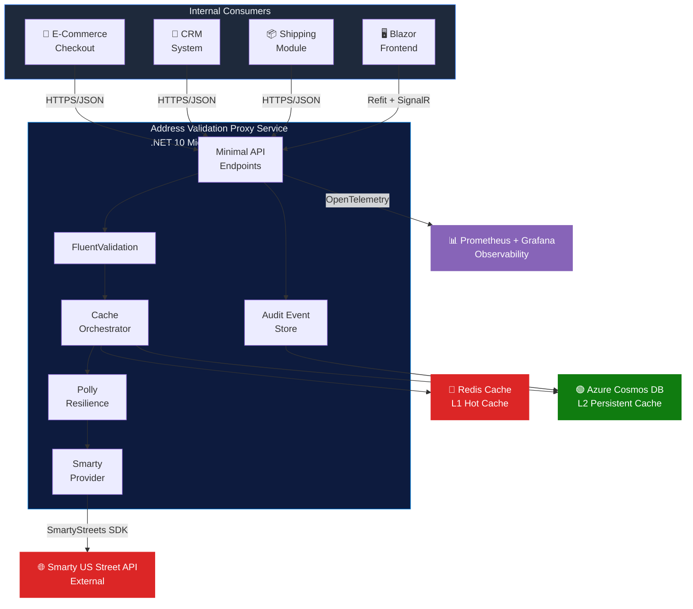


## 2.4 Technology Stack


| Layer | Technology | Details |
| --- | --- | --- |
| Runtime | .NET 10, C# 13 | Latest LTS runtime with modern language features |
| Framework | ASP.NET Core Minimal API | Lightweight, high-performance HTTP endpoints |
| Gateway | YARP (Yet Another Reverse Proxy) | API gateway for traffic routing, load balancing, and cross-cutting concerns |
| Package Management | Central Package Management (CPM) | Centralized NuGet versioning via Directory.Packages.props |
| Orchestration | .NET Aspire | Cloud-ready stack for local orchestration and service discovery |
| HTTP Client | Refit | Typed HTTP client generation from interface definitions |
| Persistent Cache | Azure Cosmos DB (NoSQL, SQL API) | Globally distributed document store, partition key: `/stateCode` |
| Hot Cache | Redis (StackExchange.Redis) | In-memory cache with sub-millisecond reads |
| Resilience | Polly v8 | Retry, circuit breaker, timeout, bulkhead isolation |
| Validation | FluentValidation | Strongly-typed request validation rules |
| Observability | OpenTelemetry, Prometheus, Grafana, Serilog | Distributed tracing, metrics, structured logging |
| Deployment (Prod) | Azure Container Apps (ACA) | Serverless containers with auto-scaling and Dapr support |
| Deployment (Non-Prod) | .NET Aspire local orchestration | Containerized dependencies for local development |
| API Versioning | Asp.Versioning.Http | Header-based versioning via `Api-Version` header |
| CI/CD | Azure DevOps Pipelines (YAML multi-stage) | Build, test, Docker package, and deploy to ACA via staged pipeline with approval gate |
| Testing | xUnit, FluentAssertions, NSubstitute, Testcontainers, Verify | Full testing pyramid with snapshot verification |


# 3. Architecture


## 3.1 Architectural Style: Vertical Slice Architecture (VSA)


The Address Validation Proxy Service adopts **Vertical Slice Architecture (VSA)** as its primary architectural pattern. Unlike traditional layered architecture (Controller → Service → Repository) where changes to a single feature require modifications across multiple horizontal layers, VSA organizes code by feature. Each feature is a self-contained vertical slice containing its endpoint, handler, validator, request/response models, and any feature-specific infrastructure.


This approach offers several advantages for this service:


- **High cohesion** — all code for a feature lives together, making it easy to understand and modify
- **Low coupling** — features do not depend on each other; changes are isolated
- **Independent testability** — each slice can be unit-tested in isolation
- **Reduced shotgun surgery** — adding a new feature does not require touching shared service layers


### 3.1.1 Project Structure

```mermaid
graph TD

    ROOT["src/AddressValidation.Api/"]

    ROOT --> DOMAIN["Domain/"]
    ROOT --> INFRA["Infrastructure/"]
    ROOT --> PROG["Program.cs"]
    ROOT --> APPSETT["appsettings.json"]

    DOMAIN --> M1["AddressInput.cs"]
    DOMAIN --> M2["ValidatedAddress.cs"]
    DOMAIN --> M3["AddressAnalysis.cs"]
    DOMAIN --> M4["GeocodingResult.cs"]
    DOMAIN --> M5["ValidationMetadata.cs"]
    DOMAIN --> M6["ValidationResponse.cs"]
    DOMAIN --> M7["AddressHashExtensions.cs"]

    INFRA --> SVC["Services/Caching/  T3"]
    INFRA --> MW["Middleware/"]
    INFRA --> CFG["Configuration/"]
    INFRA --> LEGACY["Caching/ Redis/ CosmosDb/ — legacy"]
    INFRA --> SE["ServiceCollectionExtensions.cs"]

    SVC --> C1["ICacheService.cs"]
    SVC --> C2["CacheOrchestrator.cs"]
    SVC --> C3["RedisCacheService.cs"]
    SVC --> C4["CosmosCacheService.cs"]
    SVC --> C5["CacheWarmingService.cs"]
    SVC --> C6["CosmosDbInitializationService.cs"]

    MW --> MW1["CorrelationIdMiddleware.cs"]
    MW --> MW2["ExceptionHandlingMiddleware.cs"]
    MW --> MW3["SecurityHeadersMiddleware.cs"]

    CFG --> CFG1["AzureKeyVaultConfiguration.cs"]

    style ROOT fill:#0d1b3e,stroke:#0078D4,color:#f1f5f9
    style DOMAIN fill:#1e3a5f,stroke:#3b82f6,color:#f1f5f9
    style INFRA fill:#14532d,stroke:#22c55e,color:#f1f5f9
    style SVC fill:#7c2d12,stroke:#f97316,color:#f1f5f9
```

> **Note:** VSA vertical slices (`Features/ValidateSingle`, `Features/ValidateBatch`, etc.) are planned but not yet implemented. Domain models currently reside in a flat `Domain/` folder.

## 3.2 Header-Based API Versioning Strategy


The API uses **header-based versioning exclusively**. Clients must include the `Api-Version` header in every request. This approach keeps URLs clean and RESTful while allowing version evolution without breaking hypermedia links or cached URL patterns.


| Property | Value |
| --- | --- |
| Request Header | `Api-Version: 1.0` |
| Default Behavior | When header is omitted, return HTTP 400 with descriptive error message |
| Current Version | 1.0 |
| Planned Version | 2.0 (international address support — future) |
| Implementation | `Asp.Versioning.Http` with `HeaderApiVersionReader("Api-Version")` |
| Deprecation Policy | Deprecated versions supported for 6 months with `Sunset` response header |


### 3.2.1 Configuration


```

builder.Services.AddApiVersioning(options =>
{
    options.DefaultApiVersion = new ApiVersion(1, 0);
    options.AssumeDefaultVersionWhenUnspecified = false;
    options.ReportApiVersions = true;
    options.ApiVersionReader = new HeaderApiVersionReader("Api-Version");
});

```


Important


The `AssumeDefaultVersionWhenUnspecified` property is explicitly set to `false`. Clients that omit the `Api-Version` header will receive an HTTP 400 response, ensuring intentional version selection and preventing accidental use of a default version during version transitions.


## 3.3 Caching Architecture (Two-Tier)


The service implements a two-tier caching strategy to balance performance and durability:


| Tier | Technology | Implementation | TTL | Latency Target | Purpose |
| --- | --- | --- | --- | --- | --- |
| **L1 — Hot** | Redis | `RedisCacheService<T>` | 1 hour (3,600s) | < 5ms p99 | Sub-millisecond reads for hot addresses; absorbs burst traffic |
| **L2 — Persistent** | Azure Cosmos DB | `CosmosCacheService<T>` | 90 days (7,776,000s) | < 15ms p99 | Durable store of all validated addresses; survives Redis evictions and restarts |

The T3 milestone introduced a fully generic, multi-level cache abstraction:

| Type | Responsibility |
| --- | --- |
| `ICacheService<T>` | Generic interface: `GetAsync`, `SetAsync`, `RemoveAsync`, `ExistsAsync` |
| `CacheOrchestrator<T>` | L1 → L2 → Provider lookup with write-through on miss; returns `CacheResult<T>` with `CacheSourceMetadata` |
| `RedisCacheService<T>` | L1 implementation (`StackExchange.Redis`); JSON serialized, configurable TTL |
| `CosmosCacheService<T>` | L2 implementation (Azure Cosmos DB); stores items with native TTL field |
| `CacheWarmingService` | Hosted service that pre-warms caches on startup (extensible placeholder) |
| `CosmosDbInitializationService` | Ensures Cosmos DB database and cache container exist at startup |


### 3.3.1 Cache Key Strategy


Cache keys are generated by `AddressHashExtensions.ComputeCacheKey`. The address is normalized (uppercase, trimmed) before hashing. The key format includes a version prefix to prevent cross-version cache contamination:


```
Key Format:  addr:v1:{64-char-SHA-256-hex}
Example:     addr:v1:a3f2b8c9d1e4f5a6b7c8d9e0f1a2b3c4d5e6f7a8b9c0d1e2f3a4b5c6d7e8f9a0
```

Bumping `v1` → `v2` automatically invalidates all prior entries.


### 3.3.2 Lookup Flow


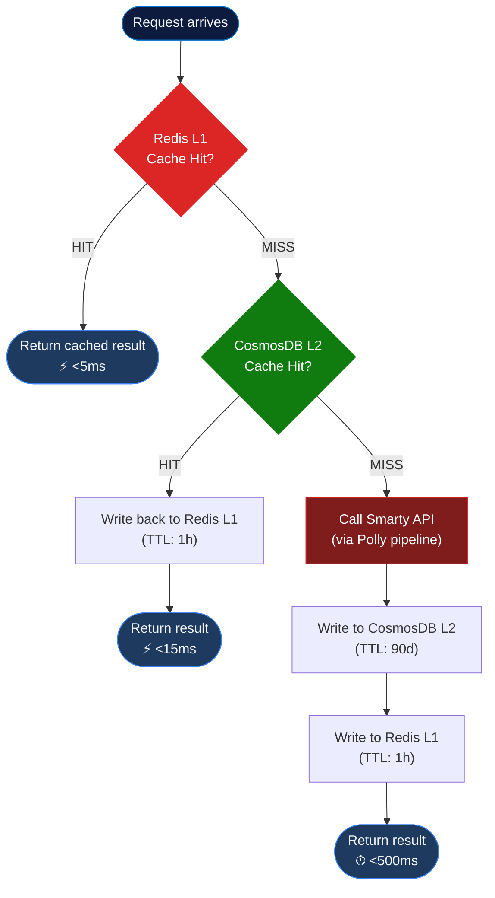


## 3.4 YARP Reverse Proxy Gateway


The **AddressValidation.Gateway** project implements a YARP (Yet Another Reverse Proxy) reverse proxy layer that acts as a single entry point for all client requests. This gateway pattern provides several architectural benefits:

### 3.4.1 Gateway Responsibilities

- **Request Routing**: Routes `/api/address/*` traffic to the Address Validation API
- **Cross-Cutting Concerns**: Centralized security headers, CORS handling, request correlation
- **Health Checks**: Exposes `/health` endpoint for orchestrator probes
- **Observable Traffic Flow**: Logs and traces all traffic for monitoring and debugging

### 3.4.2 Architecture Diagram

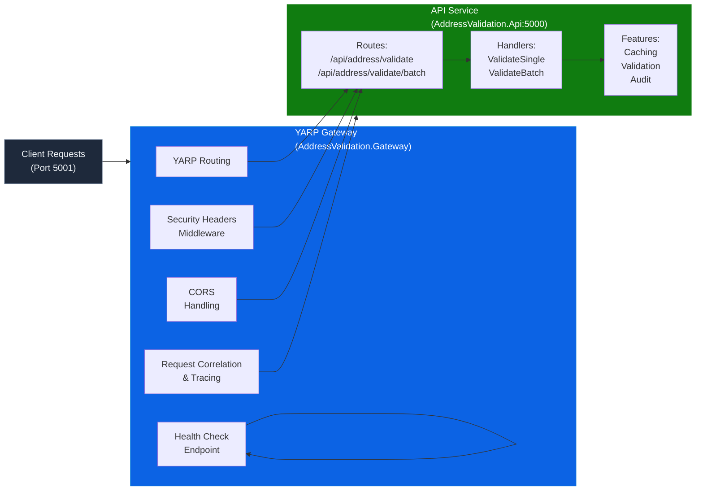

### 3.4.3 Configuration (appsettings.json)

```json
{
  "ReverseProxy": {
    "Routes": {
      "addressValidationRoute": {
        "ClusterId": "addressValidationCluster",
        "Match": {
          "Path": "/api/address/{**catch-all}"
        },
        "Transforms": [
          { "PathPrefix": "/api/address" }
        ]
      }
    },
    "Clusters": {
      "addressValidationCluster": {
        "HttpClient": {
          "Timeout": "00:00:30"
        },
        "Destinations": {
          "destination1": {
            "Address": "http://localhost:5000"
          }
        }
      }
    }
  }
}
```

### 3.4.4 Middleware Pipeline

```
Request
  ↓
[Security Headers Middleware]  ← Add X-Content-Type-Options, X-Frame-Options, etc.
  ↓
[CORS Middleware]              ← Handle cross-origin requests
  ↓
[Correlation ID Middleware]    ← Generate/propagate correlation ID
  ↓
[YARP Routing]                 ← Route to destination cluster
  ↓
[Destination: AddressValidation.Api]
  ↓
Response
```

### 3.4.5 Health Check Endpoint

- **Path**: `GET /health`
- **Response**: `200 OK` with `{ "status": "Healthy" }`
- **Purpose**: Used by Aspire AppHost for liveness probes

### 3.4.6 Aspire Integration

The Gateway is integrated into the Aspire AppHost:

```csharp
var gateway = builder
    .AddProject<Projects.AddressValidation_Gateway>("gateway")
    .WithReference(api)
    .WithHttpEndpoint(port: 5001, targetPort: 5001, name: "http");
```

This ensures:
- Gateway automatically discovers API service location via Aspire's service discovery
- Both services run in the same Aspire orchestration context
- Easy scaling and configuration changes

# 4. Functional Requirements


## 4.1 FR-001: Validate Single Address


| Property | Details |
| --- | --- |
| **ID** | FR-001 |
| **Title** | Validate Single Address |
| **Priority** | P1 (Must Have) |
| **Endpoint** | `POST /api/addresses/validate` |
| **Headers** | `Api-Version: 1.0`, `X-Api-Key: {key}`, `Content-Type: application/json` |
| **Description** | Accepts a single US address, validates it against the two-tier cache and Smarty US Street API, and returns a standardized, CASS-certified address with DPV analysis, geocoding, and metadata. |
| **Request Body** | `{ street, street2, city, state, zipCode, addressee }` — `street` is required; `addressee` is optional |
| **Response** | Validated address with: `validatedAddress` (USPS-standardized components), `analysis` (dpv\_match\_code, dpv\_footnotes, dpv\_cmra, dpv\_vacant, active, footnotes, lacslink\_code, lacslink\_indicator, suitelink\_match), `geocoding` (latitude, longitude, precision), `metadata` (providerName, validatedAt, cacheSource, apiVersion) |
| **Cache Behavior** | Check L1 (Redis) → L2 (CosmosDB) → Smarty API on cache miss. On Smarty response, write to both L2 and L1. |
| **Status Codes** | 200 (valid), 400 (validation error), 401 (unauthorized), 404 (address not found/undeliverable), 429 (rate limited), 500 (server error), 503 (Smarty unavailable) |
| **Acceptance Criteria** | 1) Valid address returns 200 with all CASS fields populated. 2) Invalid input returns 400 with RFC 7807 error body. 3) Cache hit returns result without Smarty API call. 4) Response includes `X-Cache-Source` header indicating L1/L2/PROVIDER. |
| **Dependencies** | Redis, CosmosDB, Smarty US Street API, FluentValidation |


## 4.2 FR-002: Validate Batch Addresses


| Property | Details |
| --- | --- |
| **ID** | FR-002 |
| **Title** | Validate Batch Addresses |
| **Priority** | P1 (Must Have) |
| **Endpoint** | `POST /api/addresses/validate/batch` |
| **Headers** | `Api-Version: 1.0`, `X-Api-Key: {key}`, `Content-Type: application/json` |
| **Description** | Accepts an array of up to 100 address objects. Each address is checked individually against the cache; only cache misses are forwarded to Smarty in a single batch call. Results are returned maintaining input order. |
| **Request Body** | `{ addresses: [ { street, street2, city, state, zipCode, addressee }, ... ] }` |
| **Response** | Array of `ValidationResponse` objects, each with `inputIndex` preserving original order |
| **Batch Logic** | 1) Compute cache key for each address. 2) Parallel lookup in Redis. 3) Remaining misses checked in CosmosDB. 4) Final misses batched to Smarty (max 100 per Smarty API call). 5) Results merged and sorted by input index. |
| **Status Codes** | 200 (all processed), 400 (validation error — exceeds 100 or invalid input), 401 (unauthorized), 429 (rate limited), 207 (partial success — some addresses failed) |
| **Acceptance Criteria** | 1) 100 addresses processed within 2 seconds (p95). 2) Input order preserved in response. 3) Only uncached addresses sent to Smarty. 4) Individual address failures do not block entire batch. |
| **Dependencies** | FR-001, Redis, CosmosDB, Smarty US Street API |


## 4.3 FR-003: Cache Management


| Property | Details |
| --- | --- |
| **ID** | FR-003 |
| **Title** | Cache Management |
| **Priority** | P2 (Should Have) |
| **Endpoints** | `GET /api/cache/stats` — Returns hit/miss ratios and entry counts for both Redis and CosmosDB
`DELETE /api/cache/{key}` — Invalidate a specific cached address by key
`DELETE /api/cache/flush` — Flush Redis hot cache (CosmosDB data retained)
  |
| **Authorization** | Cache management endpoints require `admin` role via RBAC. Standard API keys have read-only cache stats access. |
| **Response (stats)** | `{ redis: { hitCount, missCount, hitRatio, entryCount, memoryUsageBytes }, cosmos: { hitCount, missCount, hitRatio, documentCount, ruConsumed } }` |
| **Acceptance Criteria** | 1) Stats endpoint returns accurate counters. 2) Key invalidation removes from both Redis and marks as stale in CosmosDB. 3) Flush only affects Redis. 4) Non-admin requests to DELETE endpoints return 403. |
| **Dependencies** | Redis, CosmosDB, RBAC middleware |


## 4.4 FR-004: Audit Logging


| Property | Details |
| --- | --- |
| **ID** | FR-004 |
| **Title** | Audit Logging |
| **Priority** | P1 (Must Have) |
| **Description** | Every validation request/response is logged as an immutable audit event using event sourcing. Events are stored in a dedicated CosmosDB container and provide a complete, traceable record of all system activity. |
| **Event Data** | Timestamp, request hash (SHA-256 of input — not raw PII), source IP (hashed), cache hit/miss level, provider response time (ms), validation result summary (dpvMatchCode, deliverability), correlation ID |
| **Storage** | CosmosDB `audit-events` container, partition key `/requestDate`, TTL 365 days |
| **Acceptance Criteria** | 1) Every validation produces at least one audit event. 2) Events are immutable (append-only). 3) No raw PII is stored — addresses are hashed. 4) Events include correlation IDs for distributed tracing. |
| **Dependencies** | CosmosDB, OpenTelemetry correlation |


## 4.5 FR-005: Health Check Endpoints


| Property | Details |
| --- | --- |
| **ID** | FR-005 |
| **Title** | Health Check Endpoints |
| **Priority** | P1 (Must Have) |
| **Endpoints** | `GET /health/live` — Liveness probe: HTTP 200 if process is alive
`GET /health/ready` — Readiness probe: checks Redis, CosmosDB, and Smarty connectivity
`GET /health/startup` — Startup probe: verifies initial configuration and dependency availability
  |
| **Response** | `{ status: "Healthy" | "Degraded" | "Unhealthy", checks: [ { name, status, duration, description } ] }` |
| **Authentication** | Health endpoints do not require API key authentication (accessible to orchestrator probes) |
| **Acceptance Criteria** | 1) Liveness returns 200 when process is running. 2) Readiness returns 503 when any dependency is unavailable. 3) Startup returns 503 until all dependencies are initialized. 4) Each check includes duration in milliseconds. |
| **Dependencies** | ASP.NET Core Health Checks, Redis, CosmosDB, Smarty API |


## 4.6 FR-006: Metrics Exposure


| Property | Details |
| --- | --- |
| **ID** | FR-006 |
| **Title** | Metrics Exposure |
| **Priority** | P2 (Should Have) |
| **Endpoint** | `GET /metrics` — Prometheus-compatible text exposition format |
| **Metrics** | `address_validation_requests_total` (counter, labels: endpoint, status, api\_version)
`address_validation_duration_seconds` (histogram, labels: endpoint, cache\_source)
`cache_hit_ratio` (gauge, labels: cache\_tier)
`smarty_api_calls_total` (counter, labels: status\_code)
`smarty_api_errors_total` (counter, labels: error\_type)
`active_circuit_breakers` (gauge, labels: provider)
  |
| **Acceptance Criteria** | 1) Metrics endpoint returns valid Prometheus text format. 2) All counters increment correctly. 3) Histogram buckets cover 10ms to 5s range. 4) Scrape interval: 15 seconds. |
| **Dependencies** | OpenTelemetry, prometheus-net |


## 4.7 FR-007: Provider Abstraction


| Property | Details |
| --- | --- |
| **ID** | FR-007 |
| **Title** | Provider Abstraction |
| **Priority** | P2 (Should Have) |
| **Description** | The `IAddressValidationProvider` interface decouples the core validation logic from the specific vendor implementation (Smarty). This enables future swaps to alternative providers — such as Google Address Validation API, Melissa Data, or USPS Web Tools — without modifying core business logic. |
| **Interface Contract** | `ValidateAsync(AddressInput input, CancellationToken ct)` and `ValidateBatchAsync(IEnumerable<AddressInput> inputs, CancellationToken ct)` |
| **Acceptance Criteria** | 1) Replacing SmartyProvider with a mock provider requires zero changes to handler code. 2) Provider is injected via DI container. 3) Feature toggle allows runtime provider switching. |
| **Dependencies** | .NET Dependency Injection, Configuration system |


# 5. Non-Functional Requirements


## 5.1 Performance


| ID | Requirement | Target | Measurement Method |
| --- | --- | --- | --- |
| NFR-001 | Single validation latency (cache hit) | < 200ms p95 | Prometheus histogram `address_validation_duration_seconds` |
| NFR-002 | Single validation latency (cache miss) | < 800ms p95 | Prometheus histogram with `cache_source=PROVIDER` label |
| NFR-003 | Batch validation (100 addresses) latency | < 2 seconds p95 | Prometheus histogram for batch endpoint |
| NFR-004 | Redis cache read latency | < 5ms p99 | OpenTelemetry span duration for Redis operations |
| NFR-005 | CosmosDB read latency | < 15ms p99 | CosmosDB diagnostics + OpenTelemetry span duration |


## 5.2 Availability & Reliability


| ID | Requirement | Target | Measurement Method |
| --- | --- | --- | --- |
| NFR-006 | Service uptime SLA | 99.9% (≤ 8.76 hours downtime/year) | ACA health probe + Prometheus up metric |
| NFR-007 | Graceful degradation — Smarty unavailable | Return cached results with `X-Cache-Stale: true` header | Circuit breaker state monitoring |
| NFR-008 | Circuit breaker configuration | Open after 5 consecutive failures; half-open after 30 seconds | Polly circuit breaker state events + metrics |
| NFR-009 | Audit event durability | Zero data loss for audit events | CosmosDB strong consistency for audit writes |
| NFR-010 | Cache-only mode | Service continues operating with cached data when Smarty is down | Integration test with Smarty dependency removed |


## 5.3 Scalability


| ID | Requirement | Target | Measurement Method |
| --- | --- | --- | --- |
| NFR-011 | Horizontal scaling | ACA replicas: min 2, max 10 (auto-scale on CPU/HTTP concurrency) | ACA scaling metrics |
| NFR-012 | CosmosDB auto-scale throughput | 400–4,000 RU/s (auto-scale based on demand) | CosmosDB metrics: normalized RU consumption |
| NFR-013 | Stateless service design | No in-memory session state; all state externalized to Redis/CosmosDB | Architecture review; multi-instance load test |


## 5.4 Security


| ID | Requirement | Target | Measurement Method |
| --- | --- | --- | --- |
| NFR-014 | Transport encryption | TLS 1.2+ enforced for all inbound and outbound communications | SSL Labs scan; Azure policy enforcement |
| NFR-015 | API key authentication | All consumer-facing endpoints require valid `X-Api-Key` header | Automated test: requests without key return 401 |
| NFR-016 | Credential management | Smarty auth-id/auth-token stored in Azure Key Vault, injected via Aspire configuration | Code review: no hardcoded secrets; Key Vault audit log |
| NFR-017 | RBAC for admin endpoints | Cache management DELETE endpoints require `admin` role | Automated test: non-admin requests return 403 |
| NFR-018 | Input sanitization | All endpoint inputs validated via FluentValidation before processing | Fuzz testing; boundary value analysis |
| NFR-019 | PII protection in logs | No raw addresses logged; all address data hashed (SHA-256) in audit logs and structured logs | Log audit review; automated PII scanner |


## 5.5 Observability


| ID | Requirement | Target | Measurement Method |
| --- | --- | --- | --- |
| NFR-020 | Structured logging with correlation | Every log entry includes correlation ID; Serilog with OpenTelemetry enrichment | Log query: all entries for a request share correlation ID |
| NFR-021 | Distributed tracing | End-to-end traces across Redis, CosmosDB, and Smarty API calls | Grafana Tempo / Jaeger trace visualization |
| NFR-022 | Prometheus metrics with Grafana dashboards | Pre-built dashboards for: request rate, latency percentiles, cache hit ratio, error rate, circuit breaker state | Dashboard review; alert rule validation |
| NFR-023 | Alerting rules | Alerts on: error rate > 1% (5 min window), p95 > SLA target, circuit breaker open, CosmosDB RU consumption > 80% | Alert rule configuration audit; runbook validation |


## 5.6 Maintainability


| ID | Requirement | Target | Measurement Method |
| --- | --- | --- | --- |
| NFR-024 | Code coverage | ≥ 80% (unit + integration combined) | Coverlet / ReportGenerator in CI pipeline |
| NFR-025 | Feature toggle support | Provider switching and cache tier bypass configurable via feature flags | Configuration-driven toggle test; no code redeployment required |


# 6. CQRS Flow


The Address Validation Proxy Service applies a **CQRS-lite** pattern, separating the responsibilities of commands (write operations that mutate state) from queries (read operations that return state without side effects). This separation improves clarity, testability, and allows independent optimization of read and write paths.


## 6.1 Command Side (Write Path)


| Command | Handler Behavior |
| --- | --- |
| **ValidateAddressCommand** | 1. Validate input via FluentValidation2. Check Redis (L1) for cached result3. Check CosmosDB (L2) on L1 miss4. Call Smarty API on L2 miss via Polly resilience pipeline5. Write validated result to CosmosDB (L2)6. Write validated result to Redis (L1)7. Emit `AddressValidatedEvent` to audit event store |
| **InvalidateCacheCommand** | 1. Remove specific entry from Redis (L1)2. Mark entry as stale in CosmosDB (L2) by setting `isStale: true`3. Emit `CacheEntryInvalidated` event |
| **FlushCacheCommand** | 1. Clear Redis hot cache (FLUSHDB on the cache database)2. CosmosDB data is retained (persistent store)3. Emit `CacheFlushed` event |


## 6.2 Query Side (Read Path)


| Query | Handler Behavior |
| --- | --- |
| **GetCachedAddressQuery** | Read from Redis (L1) → fall back to CosmosDB (L2). No writes to cache or event store. Returns cached result with `cacheSource` metadata. |
| **GetCacheStatsQuery** | Aggregate hit/miss metrics from Redis INFO command and CosmosDB diagnostics. Returns `CacheStatsResponse`. |
| **GetAuditTrailQuery** | Read event stream from CosmosDB `audit-events` container. Supports filtering by date range, aggregate ID, and event type. |


## 6.3 CQRS Flow Diagram


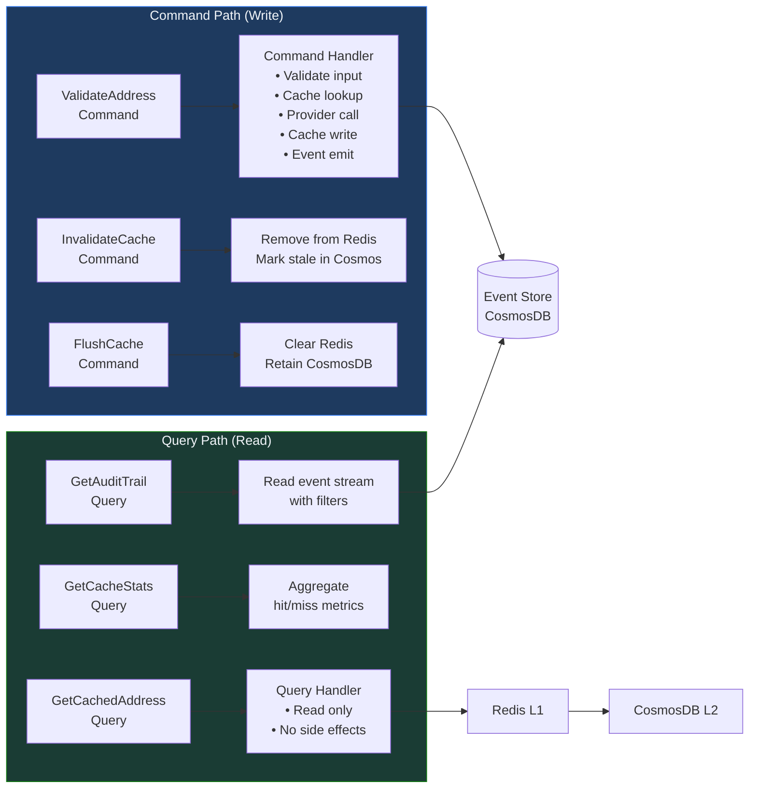


# 7. Event Sourcing


The Address Validation Proxy Service uses event sourcing for its audit trail, capturing every significant action as an immutable domain event. This provides a complete, append-only history of all system activities, enabling audit compliance, operational debugging, replay for analytics, and cache warming from historical data.


## 7.1 Event Store


| Property | Value |
| --- | --- |
| Storage | Azure Cosmos DB — dedicated container |
| Container Name | `audit-events` |
| Partition Key | `/requestDate` (format: YYYY-MM-DD) |
| TTL | 365 days (31,536,000 seconds) |
| Consistency Level | Strong (for audit write operations) |
| Change Feed | Enabled — for downstream analytics and event projection |
| Indexing | Include: `/eventType`, `/aggregateId`, `/timestamp`; Exclude: `/data/*` |


## 7.2 Domain Events


| Event Type | Description | Key Data Fields |
| --- | --- | --- |
| `AddressValidationRequested` | Emitted when a validation request is received | requestId, timestamp, inputHash, sourceIpHash, apiVersion |
| `CacheLookupCompleted` | Emitted after cache lookup (hit or miss) | requestId, cacheLevel (L1/L2/MISS), lookupDurationMs |
| `ProviderCallInitiated` | Emitted when an external provider call begins | requestId, providerName, batchSize |
| `ProviderCallCompleted` | Emitted when provider call returns | requestId, providerName, durationMs, resultCount, httpStatus |
| `AddressValidated` | Emitted when address validation succeeds | requestId, dpvMatchCode, deliverability, geocodePrecision |
| `ValidationFailed` | Emitted when validation fails | requestId, errorCode, errorMessage |
| `CacheEntryWritten` | Emitted when a cache entry is written | requestId, cacheLevel, key, ttlSeconds |
| `CircuitBreakerStateChanged` | Emitted on circuit breaker state transitions | providerName, previousState, newState, timestamp |


## 7.3 Event Schema


All domain events conform to the following JSON schema:


```

{
  "id": "550e8400-e29b-41d4-a716-446655440000",
  "eventType": "AddressValidated",
  "aggregateId": "req\_a1b2c3d4-e5f6-7890-abcd-ef1234567890",
  "requestDate": "2026-05-06",
  "timestamp": "2026-05-06T11:08:32.456Z",
  "version": 1,
  "data": {
    "dpvMatchCode": "Y",
    "deliverability": "Deliverable",
    "geocodePrecision": "Zip9"
  },
  "metadata": {
    "correlationId": "corr\_x1y2z3",
    "causationId": "cmd\_validate\_a1b2c3",
    "userId": "api\_key\_hash\_abc123",
    "serviceVersion": "2.0.0"
  }
}

```

## 7.4 Event Replay & Analytics


The event sourcing architecture enables the following capabilities:


| Capability | Description |
| --- | --- |
| **Audit Compliance** | Complete, immutable record of every validation operation. Supports SOC 2, GDPR data processing evidence, and internal audit requirements. |
| **Operational Debugging** | Replay the exact sequence of events for any request using the correlation ID. Identify where failures occurred in the pipeline. |
| **Analytics Projection** | CosmosDB Change Feed projects events to downstream analytics systems (e.g., Azure Synapse, Power BI) for usage dashboards and cost analysis. |
| **Cache Warming** | On service cold start, replay recent `AddressValidated` events to pre-populate Redis (L1) with frequently validated addresses. |


# 8. Database Schema


## 8.1 CosmosDB — Validated Addresses Container


| Property | Value |
| --- | --- |
| Container Name | `validated-addresses` |
| Partition Key | `/stateCode` |
| TTL | 90 days (7,776,000 seconds) |
| Throughput | Auto-scale: 400–4,000 RU/s |
| Consistency Level | Session |


### 8.1.1 Document Model


```

{
  "id": "a3f2b8c9d1e4f5a6b7c8d9e0f1a2b3c4d5e6f7a8b9c0d1e2f3a4b5c6d7e8f9a0",
  "stateCode": "VA",
  "inputAddress": {
    "street": "25000 Riding Center Dr",
    "street2": null,
    "city": "South Riding",
    "state": "VA",
    "zipCode": "20152"
  },
  "validatedAddress": {
    "primaryNumber": "25000",
    "streetName": "Riding Center",
    "streetSuffix": "Dr",
    "secondaryDesignator": null,
    "secondaryNumber": null,
    "cityName": "South Riding",
    "stateAbbreviation": "VA",
    "zipCode": "20152",
    "plus4Code": "4466",
    "deliveryPoint": "00",
    "deliveryPointCheckDigit": "0"
  },
  "analysis": {
    "dpvMatchCode": "Y",
    "dpvFootnotes": "AABB",
    "dpvCmra": "N",
    "dpvVacant": "N",
    "active": "Y",
    "footnotes": "N#",
    "lacsLinkCode": "",
    "lacsLinkIndicator": "",
    "suiteLinkMatch": false
  },
  "geocoding": {
    "latitude": 38.9218,
    "longitude": -77.5102,
    "precision": "Zip9",
    "coordinateLicense": 1
  },
  "metadata": {
    "providerName": "Smarty",
    "validatedAt": "2026-05-06T11:08:32.456Z",
    "apiVersion": "1.0",
    "smartyResponseId": "d290f1ee-6c54-4b01-90e6-d701748f0851"
  },
  "ttl": 7776000,
  "\_ts": 1746532112
}

```

### 8.1.2 Indexing Policy


| Type | Paths | Rationale |
| --- | --- | --- |
| **Included** | `/stateCode/?`, `/validatedAddress/zipCode/?`, `/metadata/validatedAt/?` | Support queries by state, ZIP code, and validation timestamp |
| **Excluded** | `/inputAddress/*`, `/geocoding/*` | Reduce RU cost for write operations; these fields are not queried directly |
| **Composite** | `/stateCode ASC, /metadata/validatedAt DESC` | Efficient pagination of recent validations per state |


## 8.2 CosmosDB — Audit Events Container


| Property | Value |
| --- | --- |
| Container Name | `audit-events` |
| Partition Key | `/requestDate` (YYYY-MM-DD) |
| TTL | 365 days (31,536,000 seconds) |
| Throughput | Auto-scale: 400–2,000 RU/s |
| Change Feed | Enabled — for downstream analytics projection |
| Consistency Level | Strong (audit write integrity) |


## 8.3 Redis Cache Schema


| Property | Value |
| --- | --- |
| Key Pattern | `addr:v{apiVersion}:{sha256_hash}` |
| Value | Serialized JSON of `ValidatedAddressResponse` (compressed with Brotli) |
| TTL | 3,600 seconds (1 hour) |
| Eviction Policy | `allkeys-lru` (Least Recently Used) |
| Serialization | System.Text.Json with source generators for AOT compatibility |
| Database | Database 0 (configurable) |


# 9. API Specifications


## 9.1 Versioning


All consumer-facing endpoints require the `Api-Version` header. Omitting the header returns HTTP 400 with the following error body:


```

{
  "type": "https://tools.ietf.org/html/rfc7807",
  "title": "API Version Required",
  "status": 400,
  "detail": "The Api-Version header is required. Supported versions: 1.0",
  "instance": "/api/addresses/validate"
}

```

## 9.2 Authentication


All consumer-facing endpoints require the `X-Api-Key` header. Health check and metrics endpoints are excluded from authentication to allow orchestrator and monitoring tool access.


## 9.3 Endpoint Specifications


### 9.3.1 POST /api/addresses/validate


| Property | Value |
| --- | --- |
| Method | POST |
| Path | `/api/addresses/validate` |
| Headers | `Api-Version: 1.0`, `X-Api-Key: {key}`, `Content-Type: application/json` |
| Rate Limit | 1,000 requests/minute per API key |


**Request Body:**


```

{
  "street": "1600 Amphitheatre Pkwy",
  "street2": null,
  "city": "Mountain View",
  "state": "CA",
  "zipCode": "94043",
  "addressee": "Google LLC"
}

```

**Response Body (200 OK):**


```

{
  "inputAddress": {
    "street": "1600 Amphitheatre Pkwy",
    "city": "Mountain View",
    "state": "CA",
    "zipCode": "94043"
  },
  "validatedAddress": {
    "deliveryLine1": "1600 Amphitheatre Pkwy",
    "lastLine": "Mountain View CA 94043-1351",
    "primaryNumber": "1600",
    "streetName": "Amphitheatre",
    "streetSuffix": "Pkwy",
    "cityName": "Mountain View",
    "stateAbbreviation": "CA",
    "zipCode": "94043",
    "plus4Code": "1351",
    "deliveryPoint": "00",
    "deliveryPointCheckDigit": "0"
  },
  "analysis": {
    "dpvMatchCode": "Y",
    "dpvFootnotes": "AABB",
    "dpvCmra": "N",
    "dpvVacant": "N",
    "active": "Y",
    "footnotes": "N#",
    "lacsLinkCode": "",
    "lacsLinkIndicator": "",
    "suiteLinkMatch": false
  },
  "geocoding": {
    "latitude": 37.4224,
    "longitude": -122.0842,
    "precision": "Zip9",
    "coordinateLicense": 1
  },
  "metadata": {
    "providerName": "Smarty",
    "validatedAt": "2026-05-06T11:08:32.456Z",
    "cacheSource": "PROVIDER",
    "apiVersion": "1.0",
    "requestDurationMs": 342
  }
}

```

### 9.3.2 POST /api/addresses/validate/batch


| Property | Value |
| --- | --- |
| Method | POST |
| Path | `/api/addresses/validate/batch` |
| Max Batch Size | 100 addresses |
| Rate Limit | 1,000 requests/minute per API key (batch counts as 1 request) |


**Request Body:**


```

{
  "addresses": [
    { "street": "1600 Amphitheatre Pkwy", "city": "Mountain View", "state": "CA", "zipCode": "94043" },
    { "street": "1 Microsoft Way", "city": "Redmond", "state": "WA", "zipCode": "98052" }
  ]
}

```

**Response Body (200 OK):**


```

{
  "results": [
    { "inputIndex": 0, "status": "validated", "validatedAddress": { ... }, "analysis": { ... }, "geocoding": { ... }, "metadata": { "cacheSource": "L1" } },
    { "inputIndex": 1, "status": "validated", "validatedAddress": { ... }, "analysis": { ... }, "geocoding": { ... }, "metadata": { "cacheSource": "PROVIDER" } }
  ],
  "summary": {
    "total": 2,
    "validated": 2,
    "failed": 0,
    "cacheHits": 1,
    "cacheMisses": 1,
    "totalDurationMs": 487
  }
}

```

### 9.3.3 GET /api/cache/stats


| Property | Value |
| --- | --- |
| Method | GET |
| Path | `/api/cache/stats` |
| Authorization | Any valid API key (read-only) |


### 9.3.4 DELETE /api/cache/{key}


| Property | Value |
| --- | --- |
| Method | DELETE |
| Path | `/api/cache/{key}` |
| Authorization | Admin role required (RBAC) |
| Status Codes | 204 (deleted), 401 (unauthorized), 403 (forbidden — not admin), 404 (key not found) |


### 9.3.5 DELETE /api/cache/flush


| Property | Value |
| --- | --- |
| Method | DELETE |
| Path | `/api/cache/flush` |
| Authorization | Admin role required (RBAC) |
| Behavior | Flushes Redis (L1) only; CosmosDB (L2) retained |
| Status Codes | 204 (flushed), 401, 403 |


### 9.3.6 Health & Metrics Endpoints


| Endpoint | Method | Auth | Response |
| --- | --- | --- | --- |
| `/health/live` | GET | None | 200 (alive) / 503 (dead) |
| `/health/ready` | GET | None | 200 (all dependencies healthy) / 503 (degraded) |
| `/health/startup` | GET | None | 200 (initialized) / 503 (starting) |
| `/metrics` | GET | None | Prometheus text exposition format |


## 9.4 Error Response Schema


All error responses follow the **RFC 7807 Problem Details** standard:


```

{
  "type": "https://tools.ietf.org/html/rfc7807",
  "title": "Validation Failed",
  "status": 400,
  "detail": "One or more validation errors occurred.",
  "instance": "/api/addresses/validate",
  "errors": {
    "street": ["Street is required."],
    "state": ["State must be a valid 2-letter US state abbreviation."]
  },
  "traceId": "00-abc123def456789-0123456789abcdef-01"
}

```

## 9.5 Rate Limiting


| Property | Value |
| --- | --- |
| Limit | 1,000 requests per minute per API key |
| Batch Counting | 1 batch request = 1 request (regardless of batch size) |
| Algorithm | Fixed window counter with sliding window fallback |
| Exceeded Response | HTTP 429 Too Many Requests |
| Headers | `Retry-After: {seconds}`, `X-RateLimit-Limit: 1000`, `X-RateLimit-Remaining: {n}`, `X-RateLimit-Reset: {unix_timestamp}` |


# 10. Sequence Diagrams


## 10.1 Diagram 1: Single Address Validation — Cache Hit (Redis L1)


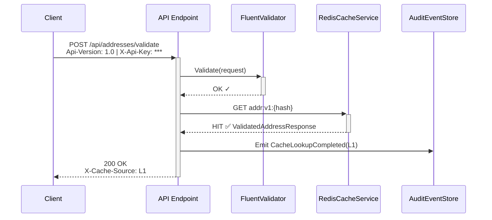


## 10.2 Diagram 2: Single Address Validation — Cache Miss (Full Flow)


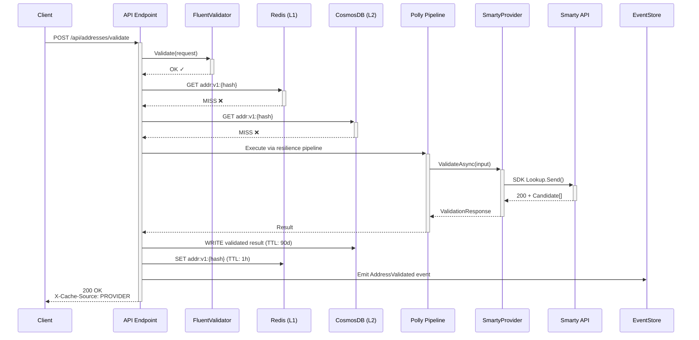


## 10.3 Diagram 3: Batch Validation — Partial Cache Hits


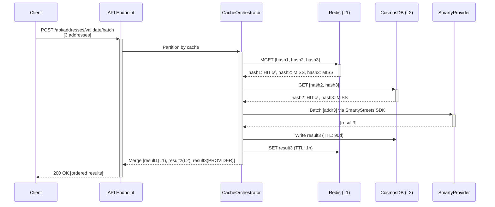


## 10.4 Diagram 4: Circuit Breaker Activation


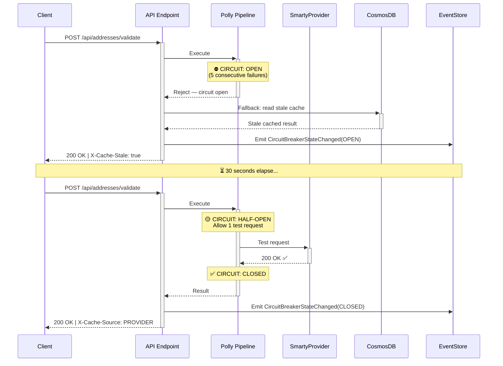


# 11. Class Diagrams


## 11.1 Core Domain Models


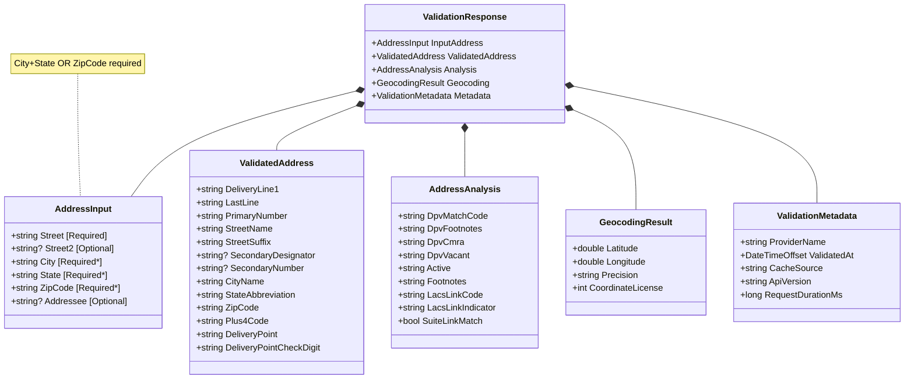


## 11.2 Infrastructure Interfaces


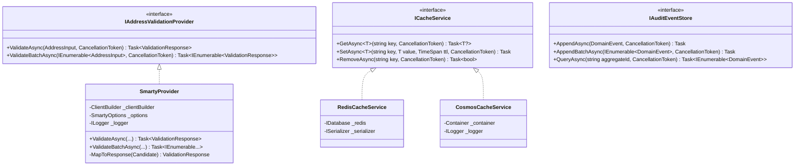


## 11.3 Handler Classes


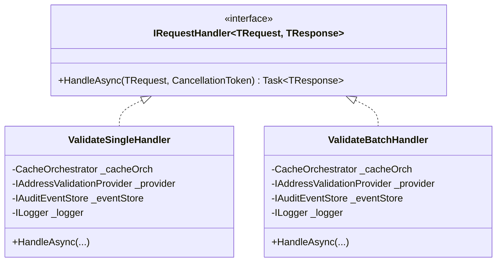


# 12. C4 Model


## 12.1 Level 1 — System Context


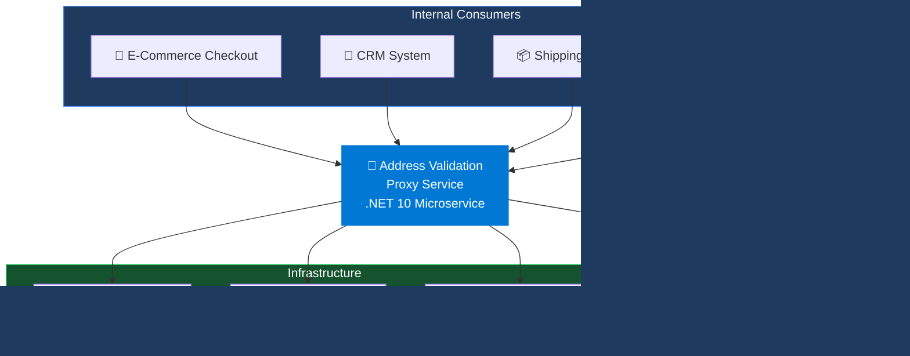


## 12.2 Level 2 — Container Diagram


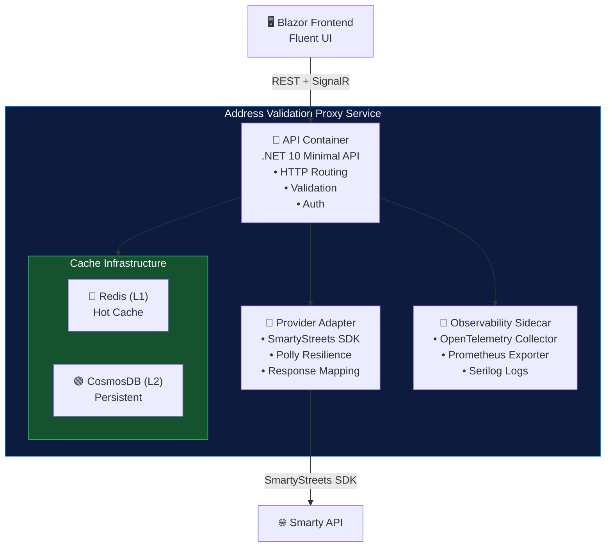


## 12.3 Level 3 — Component Diagram (API Container)


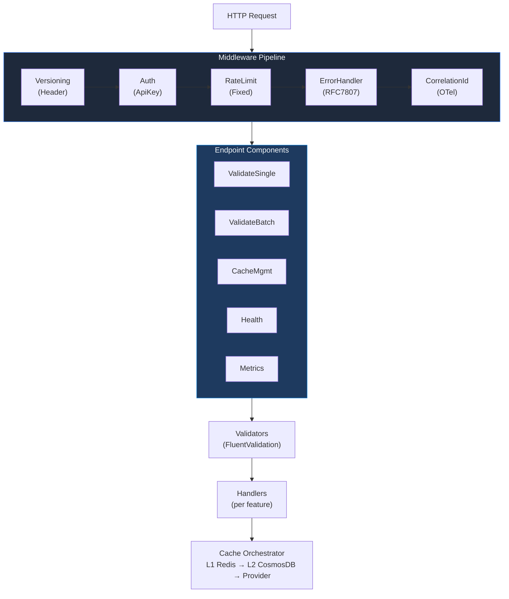


## 12.4 Level 4 — Code Diagram (ValidateSingle Feature)


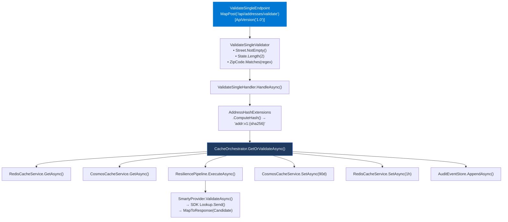


# 13. Architecture Decision Records (ADRs)


## 13.1 ADR-001: Use Header-Based API Versioning


| Field | Details |
| --- | --- |
| **Title** | ADR-001: Use Header-Based API Versioning over URL Path Versioning |
| **Status** | Accepted |
| **Date** | 2026-04-01 |
| **Context** | The service needs API versioning to support backward compatibility as the API evolves. Four options were evaluated: (1) URL path versioning (`/v1/addresses`), (2) Query string (`?api-version=1.0`), (3) Header-based (`Api-Version: 1.0`), (4) Content negotiation via media type. The team prioritized clean URLs, enterprise gateway compatibility, and adherence to RESTful principles. |
| **Decision** | Header-based versioning using the `Api-Version` custom header, implemented via `Asp.Versioning.Http` with `HeaderApiVersionReader("Api-Version")`. The default version is not assumed — clients must explicitly provide the header. |
| **Rationale** | 1) Keeps URLs clean and truly RESTful — resources are identified by URI, not version. 2) Does not break hypermedia links or cached URL patterns. 3) Azure API Management natively supports header-based versioning. 4) Aligns with Microsoft REST API Guidelines. 5) Prevents accidental version misuse by requiring explicit header. |
| **Consequences** | **Positive:** Clean URLs, gateway-friendly, RESTful. **Negative:** Clients must always include the header; less discoverable than URL versioning; Swagger/OpenAPI documentation must explicitly document the header requirement; testing tools (curl, Postman) require manual header configuration. |


## 13.2 ADR-002: Use CosmosDB for Persistent Address Caching


| Field | Details |
| --- | --- |
| **Title** | ADR-002: Use Azure Cosmos DB for Persistent Address Caching (Replacing Azure Table Storage) |
| **Status** | Accepted |
| **Date** | 2026-04-15 |
| **Context** | A durable store is needed for validated addresses to reduce Smarty API calls across Redis evictions and service restarts. Azure Table Storage was the initial candidate due to lower cost, but it lacks rich querying, global distribution, TTL support, and auto-scaling. The projected data volume (10M+ documents) and query patterns favor a more capable document store. |
| **Decision** | Azure Cosmos DB (NoSQL API) with partition key `/stateCode`, auto-scale throughput (400–4,000 RU/s), 90-day TTL, and Change Feed enabled. |
| **Rationale** | 1) Sub-15ms point reads at p99. 2) Native TTL support eliminates manual cleanup. 3) Auto-scale RU/s adapts to traffic spikes. 4) Change Feed enables downstream analytics. 5) Global distribution option for future multi-region deployment. 6) SQL-like query syntax for ad-hoc analysis. |
| **Consequences** | **Positive:** Superior performance, TTL, Change Feed, global distribution option. **Negative:** Higher cost than Table Storage (~3-5x at baseline); requires partition key design discipline; RU/s capacity planning needed; hot partition risk if state distribution is uneven. |


## 13.3 ADR-003: Use Vertical Slice Architecture over Layered Architecture


| Field | Details |
| --- | --- |
| **Title** | ADR-003: Adopt Vertical Slice Architecture over Traditional Layered Architecture |
| **Status** | Accepted |
| **Date** | 2026-04-01 |
| **Context** | Traditional layered architecture (Controller → Service → Repository) creates cross-cutting coupling: adding a new feature requires changes in the controller layer, service layer, and repository layer. This leads to "shotgun surgery" and makes features harder to understand in isolation. The Address Validation Proxy has a small number of well-defined features, making VSA an ideal fit. |
| **Decision** | Vertical Slice Architecture — each feature (ValidateSingle, ValidateBatch, CacheManagement, HealthCheck) is a self-contained folder with its own endpoint, handler, validator, and request/response models. Shared infrastructure (caching, providers, events) is extracted to an Infrastructure namespace. |
| **Consequences** | **Positive:** Better cohesion, easier onboarding (developers understand one feature at a time), independent testability, no shared service abstractions. **Negative:** Potential code duplication if features share similar logic (mitigated by shared Infrastructure layer); less familiar to developers accustomed to layered architecture. |


## 13.4 ADR-004: Two-Tier Caching Strategy (Redis + CosmosDB)


| Field | Details |
| --- | --- |
| **Title** | ADR-004: Implement Two-Tier Caching with Redis (L1) and CosmosDB (L2) |
| **Status** | Accepted |
| **Date** | 2026-04-15 |
| **Context** | A single cache layer is insufficient for this service. Redis alone: evictions lose validated data, service restarts require re-validation. CosmosDB alone: 10-15ms reads are slower than sub-millisecond Redis for hot paths. The service handles significant repeat traffic for the same addresses (e.g., checkout retries, address book lookups), making a hot cache critical for performance. |
| **Decision** | Redis as L1 hot cache (1-hour TTL, sub-millisecond reads) + CosmosDB as L2 persistent cache (90-day TTL, 10-15ms reads). Lookup order: L1 → L2 → Provider. On any cache miss, result is written to both tiers. |
| **Consequences** | **Positive:** Sub-millisecond cache hits for frequent addresses; durable cache survives restarts; dramatic reduction in Smarty API calls (estimated 85-95% cache hit rate). **Negative:** Slightly more complex cache orchestration logic; two systems to monitor and maintain; potential for brief inconsistency between L1 and L2 during TTL windows. |


## 13.5 ADR-005: Event Sourcing for Audit Trail


| Field | Details |
| --- | --- |
| **Title** | ADR-005: Use Event Sourcing Pattern for Immutable Audit Trail |
| **Status** | Accepted |
| **Date** | 2026-04-15 |
| **Context** | The service requires an immutable audit log of all validation activities for compliance, debugging, and analytics. Traditional database logging (INSERT into audit table) is mutable and lacks the ability to replay or project events. The audit trail must support: full request traceability, compliance reporting, operational debugging, and analytics projection. |
| **Decision** | Event sourcing with an append-only event store in CosmosDB (`audit-events` container). All significant actions emit domain events. Change Feed enables downstream event projection. |
| **Consequences** | **Positive:** Immutable audit trail; full replay capability; enables analytics via Change Feed; supports compliance requirements. **Negative:** Storage growth requires TTL management (365-day retention); event schema evolution needs careful versioning; slightly higher write latency due to event persistence. |


## 13.6 ADR-006: Provider Abstraction via Interface


| Field | Details |
| --- | --- |
| **Title** | ADR-006: Abstract Address Validation Provider Behind Interface |
| **Status** | Accepted |
| **Date** | 2026-04-01 |
| **Context** | Vendor lock-in to Smarty represents a business risk. Pricing changes, service degradation, or strategic shifts may require switching to an alternative provider (Google Address Validation API, Melissa Data, USPS Web Tools). Additionally, the team needs to use mock providers for testing without incurring Smarty API costs. |
| **Decision** | Define `IAddressValidationProvider` interface with `ValidateAsync` and `ValidateBatchAsync` methods. `SmartyProvider` implements this interface. Provider selection is configured via DI and feature toggles. |
| **Consequences** | **Positive:** Vendor independence; enables A/B testing of providers; mock providers for unit/integration tests; runtime provider switching via feature toggle. **Negative:** Slight abstraction overhead; response model normalization required for each provider; provider-specific features (e.g., Smarty's enhanced match mode) may not map cleanly to the interface. |


# 14. Domain Storytelling Diagram


## Story: "Customer Checks Out with a Shipping Address"


This domain storytelling narrative traces the complete journey of an address validation request through the system, identifying actors, work objects, and activities at each step.


### 14.1 Actors


| Actor | Type | Description |
| --- | --- | --- |
| Customer | Human | End user entering a shipping address during checkout |
| Checkout Service | System | Internal e-commerce service initiating validation |
| Address Validation Proxy | System | This microservice — the protagonist |
| Redis | Infrastructure | L1 hot cache |
| CosmosDB | Infrastructure | L2 persistent cache + audit event store |
| Smarty US Street API | External System | Third-party address validation vendor |


### 14.2 Work Objects


| Work Object | Description |
| --- | --- |
| `AddressInput` | Raw address entered by the customer |
| `ValidatedAddress` | USPS-standardized, CASS-certified address with DPV analysis |
| `AuditEvent` | Immutable domain event recording the validation activity |
| `CacheEntry` | Serialized validation result stored in Redis or CosmosDB |


### 14.3 Story Flow


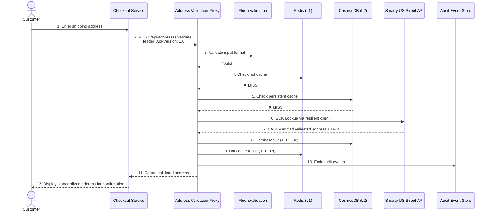


Tip


On the **next request** for the same address (e.g., the customer refreshes the page or another customer ships to the same address), the flow short-circuits at **Step 5** — Redis returns the cached result in under 5ms, and no Smarty API call is made. This is the primary cost-saving mechanism of the two-tier cache architecture.


# 15. Glossary


| Term | Definition |
| --- | --- |
| ACA | Azure Container Apps — Microsoft's serverless container platform that supports auto-scaling, Dapr integration, and managed environments for microservices. |
| ADR | Architecture Decision Record — a document capturing an important architectural decision, its context, and consequences. |
| API Gateway | An entry point for client requests that provides routing, authentication, rate limiting, and monitoring for backend APIs. |
| Aspire | .NET Aspire — an opinionated, cloud-ready stack for building observable, production-ready distributed applications with .NET. |
| Bulkhead | A resilience pattern that isolates components so that failure in one does not cascade to others, analogous to watertight compartments in a ship. |
| C4 Model | A set of hierarchical abstractions (Context, Containers, Components, Code) for describing software architecture at different levels of detail. |
| Cache Warming | The process of pre-populating a cache with data before it is needed, typically on service startup by replaying recent events. |
| CASS | Coding Accuracy Support System — a USPS certification program that validates the accuracy of address-matching software. |
| Circuit Breaker | A resilience pattern that stops calling a failing dependency after a threshold of failures, allowing it time to recover before retrying. |
| Correlation ID | A unique identifier propagated across all services and log entries for a single request, enabling end-to-end tracing. |
| CosmosDB | Azure Cosmos DB — a globally distributed, multi-model NoSQL database service with guaranteed low latency and high availability. |
| CQRS | Command Query Responsibility Segregation — a pattern that separates read and write operations into distinct models for independent optimization. |
| DPV | Delivery Point Validation — a USPS database confirming that an address is a valid delivery point that can receive mail. |
| Domain Event | An immutable record of something significant that happened in the domain, used for audit trails, event sourcing, and integration. |
| eLOT | Enhanced Line of Travel — USPS sequencing data that indicates the order in which a mail carrier delivers to addresses on a route. |
| Event Sourcing | An architectural pattern where state changes are stored as a sequence of immutable events rather than overwriting current state. |
| FluentValidation | A .NET library for building strongly-typed validation rules using a fluent interface. |
| Geocoding | The process of converting an address into geographic coordinates (latitude and longitude). |
| Hot Cache | An in-memory cache (typically Redis) optimized for sub-millisecond access to frequently requested data. |
| LACS | Locatable Address Conversion System — a USPS system that converts rural route addresses to city-style addresses. |
| Minimal API | A simplified approach in ASP.NET Core for building HTTP APIs with minimal boilerplate, using top-level statements and lambda expressions. |
| OpenTelemetry | A vendor-neutral observability framework providing APIs, SDKs, and tools for distributed tracing, metrics, and log collection. |
| Partition Key | A value in CosmosDB that determines how data is distributed across physical partitions for scalability and performance. |
| Persistent Cache | A durable cache (typically a database like CosmosDB) that survives process restarts and provides long-term storage of cached data. |
| Polly | A .NET resilience and transient-fault-handling library providing retry, circuit breaker, timeout, bulkhead, and fallback policies. |
| Provider Abstraction | A design pattern where external vendor dependencies are hidden behind an interface, enabling swapping implementations without changing business logic. |
| RBAC | Role-Based Access Control — a method of restricting access based on the roles assigned to individual users. |
| RDI | Residential Delivery Indicator — a USPS indicator showing whether an address is classified as residential or commercial. |
| Redis | An open-source, in-memory data structure store used as a database, cache, message broker, and queue. |
| Refit | A type-safe REST library for .NET that automatically generates HTTP client implementations from interface definitions. |
| Request Unit (RU) | Azure Cosmos DB's currency for database operations — a normalized measure of CPU, memory, and IOPS consumed per operation. |
| Serilog | A structured logging library for .NET that outputs logs as structured data (JSON), enabling rich querying and analysis. |
| Smarty | A SaaS company providing address verification, validation, and geocoding APIs (formerly SmartyStreets). |
| SRS | Software Requirements Specification — a comprehensive document describing the intended purpose, requirements, and architecture of a software system. |
| Structured Logging | A logging approach where log messages include machine-readable structured data (key-value pairs) rather than plain text strings. |
| TTL | Time To Live — the duration after which a cached entry or database document automatically expires and is removed. |
| Vertical Slice Architecture | An architectural pattern where code is organized by feature rather than by technical layer, with each feature containing its own endpoint, handler, validator, and models. |
| VSA | See: Vertical Slice Architecture. |


# Appendix A: Environment Configuration


| Setting Name | Type | Default | Description |
| --- | --- | --- | --- |
| `Smarty:AuthId` | string | — | Smarty API authentication ID (from Azure Key Vault) |
| `Smarty:AuthToken` | string | — | Smarty API authentication token (from Azure Key Vault) |
| `Smarty:BaseUrl` | string | `https://us-street.api.smarty.com` | Smarty US Street API base URL |
| `Smarty:MatchMode` | string | `enhanced` | Match mode: `strict`, `invalid`, `enhanced` |
| `Smarty:License` | string | `us-rooftop-geocoding-cloud` | Smarty license for geocoding precision |
| `Redis:ConnectionString` | string | — | Redis connection string (via Aspire service discovery in non-prod) |
| `Redis:TtlSeconds` | int | `3600` | Redis cache entry TTL in seconds (1 hour) |
| `Redis:Database` | int | `0` | Redis database number |
| `CosmosDb:Endpoint` | string | — | Azure Cosmos DB account endpoint URL |
| `CosmosDb:Key` | string | — | Azure Cosmos DB account key (from Azure Key Vault) |
| `CosmosDb:DatabaseName` | string | `address-validation` | Cosmos DB database name |
| `CosmosDb:AddressContainer` | string | `validated-addresses` | Container for validated address documents |
| `CosmosDb:AuditContainer` | string | `audit-events` | Container for audit event documents |
| `CosmosDb:TtlSeconds` | int | `7776000` | CosmosDB address cache TTL (90 days) |
| `CosmosDb:AuditTtlSeconds` | int | `31536000` | CosmosDB audit event TTL (365 days) |
| `CosmosDb:MaxAutoscaleThroughput` | int | `4000` | Maximum auto-scale RU/s |
| `RateLimit:RequestsPerMinute` | int | `1000` | Maximum requests per minute per API key |
| `Resilience:RetryCount` | int | `3` | Number of retry attempts for Smarty API calls |
| `Resilience:RetryDelayMs` | int | `200` | Initial retry delay (exponential backoff base) |
| `Resilience:CircuitBreakerThreshold` | int | `5` | Consecutive failures before circuit opens |
| `Resilience:CircuitBreakerDurationSec` | int | `30` | Duration circuit stays open before half-open |
| `Resilience:TimeoutSeconds` | int | `5` | Per-request timeout for Smarty API calls |
| `Resilience:BulkheadMaxParallelism` | int | `25` | Maximum concurrent Smarty API calls |
| `FeatureToggles:ProviderName` | string | `Smarty` | Active provider name (for provider switching) |
| `FeatureToggles:EnableL1Cache` | bool | `true` | Enable/disable Redis L1 cache |
| `FeatureToggles:EnableAuditEvents` | bool | `true` | Enable/disable audit event emission |


Warning


Sensitive configuration values (`Smarty:AuthId`, `Smarty:AuthToken`, `CosmosDb:Key`) must **never** be stored in `appsettings.json` or source control. These values are injected from Azure Key Vault via .NET Aspire's secret management integration in production, and from user secrets (`dotnet user-secrets`) in local development.


# Appendix B: Deployment Model


## B.1 Production Deployment


| Property | Value |
| --- | --- |
| Platform | Azure Container Apps (ACA) |
| Container Runtime | Docker (Linux, .NET 10 runtime image) |
| Min Replicas | 2 (high availability) |
| Max Replicas | 10 (auto-scale) |
| Scale Trigger | HTTP concurrency (50 concurrent requests per replica) + CPU (70% threshold) |
| Dapr Sidecar | Enabled — service-to-service invocation and state management |
| Ingress | External HTTPS with custom domain + managed TLS certificate |
| Container Registry | Azure Container Registry (ACR) with geo-replication |
| Region | East US (primary) |


## B.2 Non-Production Deployment


| Property | Value |
| --- | --- |
| Platform | .NET Aspire local orchestration |
| Redis | Containerized (Docker) — managed by Aspire |
| CosmosDB | Azure Cosmos DB Emulator (Linux container) — managed by Aspire |
| Smarty API | Live Smarty sandbox or mock provider (configurable via feature toggle) |
| Dashboard | Aspire Developer Dashboard for service monitoring |


## B.3 CI/CD Pipeline

The CI/CD pipeline is implemented using **Azure DevOps Pipelines** (YAML-based multi-stage pipeline). The pipeline is defined in `.azure-pipelines/azure-pipelines.yml` and triggered on commits to the `main` branch. A manual approval gate guards production deployments.

| Property | Value |
| --- | --- |
| Platform | Azure DevOps Pipelines |
| Trigger | Push to `main` branch (CI trigger) |
| Pipeline File | `.azure-pipelines/azure-pipelines.yml` |
| Artifact Store | Azure Artifacts |
| Container Registry | Azure Container Registry (ACR) |
| Approval Gate | Azure DevOps Environment approval (pre-production stage) |
| Agent Pool | `ubuntu-latest` (Microsoft-hosted) |

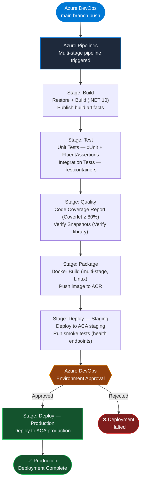


# Appendix C: Testing Strategy


| Test Type | Tools | Scope | Target |
| --- | --- | --- | --- |
| **Unit Tests** | xUnit, FluentAssertions, NSubstitute | Per feature slice — handler logic, validation rules, hash computation, response mapping | Fast, isolated, no external dependencies. Run in < 30 seconds. |
| **Integration Tests** | Testcontainers, WebApplicationFactory | Full HTTP pipeline with containerized Redis and CosmosDB Emulator. Tests: cache flow, resilience policies, error handling. | Validate end-to-end behavior with real infrastructure. Run in < 5 minutes. |
| **Contract Tests** | Verify (snapshot testing) | API response schema verification. Ensures response JSON structure matches documented contract. | Prevent breaking changes to API consumers. Snapshots committed to source control. |
| **Load Tests** | k6 | Performance validation against NFR targets: 500 RPS sustained, p95 latency targets, cache hit ratio under load. | Run against staging environment. 10-minute sustained load + spike test. |
| **Security Tests** | OWASP ZAP, manual review | Authentication bypass, input injection, PII leakage in logs, TLS configuration. | Run as part of release checklist. |


**Coverage Target:** ≥ 80% combined (unit + integration). Measured via Coverlet with ReportGenerator in the CI pipeline.


### C.1 Test Pyramid Distribution


| Layer | Count (Estimated) | Execution Time |
| --- | --- | --- |
| Unit Tests | 150–200 tests | < 30 seconds |
| Integration Tests | 40–60 tests | < 5 minutes |
| Contract Tests | 10–15 snapshots | < 10 seconds |
| Load Tests | 3–5 scenarios | 10–15 minutes |


# Appendix D: Smarty API Reference Summary


| Property | Value |
| --- | --- |
| Base URL | `https://us-street.api.smarty.com/street-address` |
| Authentication | `auth-id` + `auth-token` (query parameters or headers) |
| HTTP Methods | GET (single address), POST (batch addresses) |
| Max Batch Size | 100 addresses per POST request |
| Match Modes | `strict` (USPS match only), `invalid` (return even if invalid), `enhanced` (additional non-postal matches) |


### D.1 Key Input Fields


| Field | Type | Description |
| --- | --- | --- |
| `street` | string | Street line of the address (required) |
| `street2` | string | Secondary address line (apt, suite, etc.) |
| `city` | string | City name |
| `state` | string | Two-letter state abbreviation |
| `zipcode` | string | 5-digit or 9-digit ZIP code |
| `addressee` | string | Name of recipient (optional) |
| `candidates` | int | Maximum number of address candidates to return (1–10) |
| `match` | string | Match strategy: `strict`, `invalid`, `enhanced` |


### D.2 Key Response Fields


| Field Path | Description |
| --- | --- |
| `delivery_line_1` | Complete first delivery line (e.g., "1600 Amphitheatre Pkwy") |
| `last_line` | City, state, and ZIP+4 (e.g., "Mountain View CA 94043-1351") |
| `components.*` | Parsed address components (primary\_number, street\_name, street\_suffix, city\_name, state\_abbreviation, zipcode, plus4\_code, delivery\_point, delivery\_point\_check\_digit) |
| `metadata.*` | Enrichment data (county\_name, county\_fips, carrier\_route, congressional\_district, rdi, elot\_sequence, elot\_sort, latitude, longitude, precision, time\_zone, utc\_offset) |
| `analysis.*` | Validation analysis (dpv\_match\_code, dpv\_footnotes, dpv\_cmra, dpv\_vacant, active, footnotes, lacslink\_code, lacslink\_indicator, suitelink\_match) |


### D.3 DPV Match Codes


| Code | Meaning |
| --- | --- |
| `Y` | Confirmed — entire address is valid (primary + secondary if present) |
| `S` | Confirmed — primary number matched, secondary number not confirmed |
| `D` | Confirmed — primary number matched, secondary number missing from input |
| `N` | Not confirmed — address is not deliverable |
| (empty) | Address not found in DPV database |


### D.4 Error Codes


| HTTP Status | Description |
| --- | --- |
| 401 | Unauthorized — bad credentials (auth-id or auth-token invalid) |
| 402 | Payment Required — subscription inactive or lookups exhausted |
| 413 | Payload Too Large — request body exceeds maximum size |
| 422 | Unprocessable Entity — input data cannot be processed |
| 429 | Too Many Requests — rate limit exceeded for subscription tier |


# Appendix E: CosmosDB Capacity Planning


## E.1 Request Unit (RU) Consumption Estimates


| Operation | Document Size | Estimated RU Cost | Notes |
| --- | --- | --- | --- |
| Point Read (by id + partition key) | ~2 KB | 1 RU | Most common operation — cache lookup |
| Write (create/upsert) | ~2 KB | 5–7 RU | On cache miss — write validated address |
| Query by stateCode + zipCode | variable | 3–5 RU | Indexed query — cache stats |
| Audit Event Write | ~1 KB | 5 RU | Per event emitted |
| Audit Event Query (by date) | variable | 5–15 RU | Depends on result set size |


## E.2 Storage Projections


| Scale | Unique Addresses | Avg Doc Size | Address Storage | Audit Storage (1yr) | Total Storage |
| --- | --- | --- | --- | --- | --- |
| Small | 1,000,000 | 2 KB | ~2 GB | ~5 GB | ~7 GB |
| Medium | 10,000,000 | 2 KB | ~20 GB | ~50 GB | ~70 GB |
| Large | 100,000,000 | 2 KB | ~200 GB | ~500 GB | ~700 GB |


## E.3 Cost Estimates (East US Region)


| Scale | Throughput (RU/s) | Storage | Est. Monthly Cost (USD) |
| --- | --- | --- | --- |
| Small (400 RU/s baseline) | 400–1,000 auto-scale | ~7 GB | $25–$60 |
| Medium (400–4,000 auto-scale) | 400–4,000 auto-scale | ~70 GB | $60–$290 |
| Large (1,000–10,000 auto-scale) | 1,000–10,000 auto-scale | ~700 GB | $290–$1,450 |


Note


Cost estimates are based on Azure Cosmos DB serverless and auto-scale pricing for the East US region. Actual costs will vary based on traffic patterns, data distribution across partitions, and index density. The 90-day TTL on address documents and 365-day TTL on audit events provide automatic storage management, preventing unbounded growth.


## E.4 Partition Key Analysis


The partition key `/stateCode` distributes data across ~50 logical partitions (50 US states + DC + territories). This provides good distribution for most use cases, though states with higher population (CA, TX, FL, NY) will have larger partitions.


| State | Est. % of Total Addresses | Partition Risk |
| --- | --- | --- |
| CA | ~12% | Low — well within 20 GB logical partition limit |
| TX | ~9% | Low |
| FL | ~7% | Low |
| NY | ~6% | Low |
| Other (46 states) | ~66% | Very Low |


— End of Document —


Address Validation Proxy Service — Software Requirements Specification v2.0


Classification: Internal — Confidential


© 2026 — All Rights Reserved


